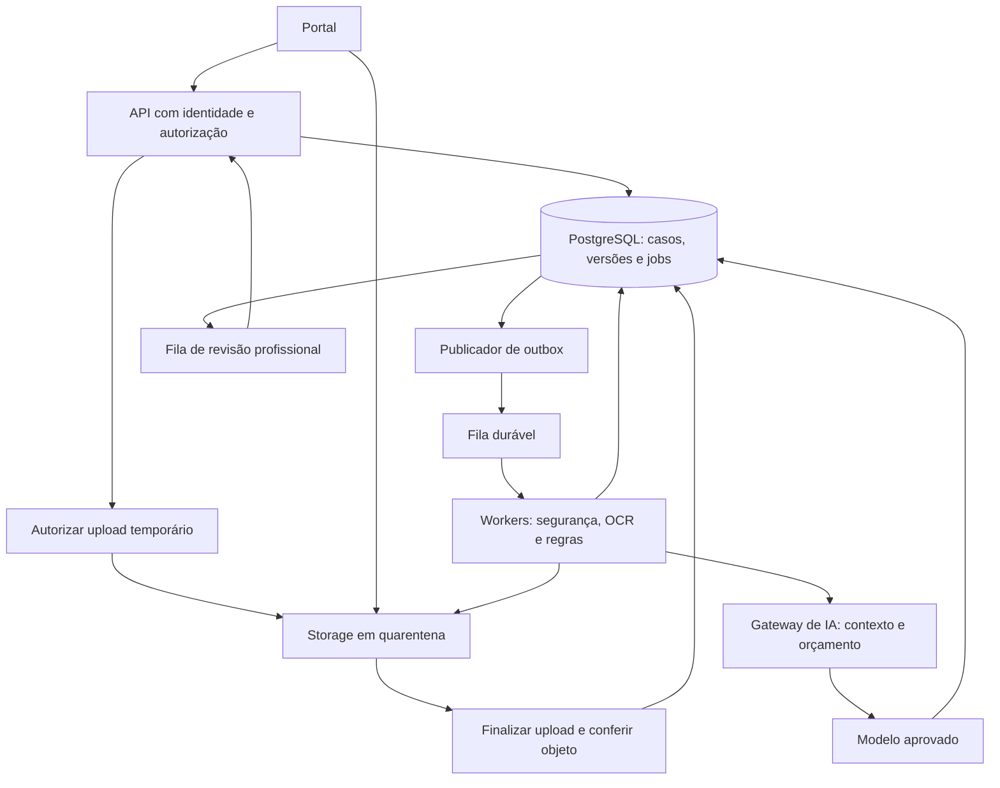

# Escalabilidade, operação e custos do ScholarOps

> Pesquisa revisada em 21/09/2026. **Arquitetura proposta e simulações**, sem teste de carga ou orçamento contratado. Complementa o [README de criação do projeto](README.md).

Escalar significa receber candidaturas dentro do prazo, processar documentos com rastreabilidade, controlar custo e permitir que a equipe conclua a revisão. Mais instâncias de API não resolvem sozinhas cotas de OCR, filas humanas ou falhas de isolamento.

## 1. Dimensionar a carga certa

Antes de escolher infraestrutura, medir:

| Variável | Por que importa |
|---|---|
| Candidaturas por edição e instituições simultâneas | Carga total e concorrência entre clientes |
| Documentos, páginas e megabytes por candidatura | Trabalho de OCR, memória e storage |
| Percentual de PDF nativo, scan, foto e manuscrito | Rotas de processamento e dificuldade |
| Concentração nas últimas horas do prazo | Pico de upload e formação de fila |
| Reenvio, duplicidade e reprocessamento | Volume efetivamente cobrado e versionamento |
| Tokens por resumo e número de tentativas | Custo e limites por minuto do LLM |
| Minutos de revisão, preparação e entrevista | Capacidade humana e ganho operacional |
| Prazo de retenção e número de cópias | Storage acumulado e custo de exclusão/backup |

### Cenários ilustrativos

Premissas para todos: 10 documentos por candidatura, 3 páginas por documento e 2 MB por arquivo. GB/TB abaixo são decimais. Valores não incluem derivados, versões e backups.

| Cenário | Candidaturas | Documentos | Páginas | Originais |
|---|---:|---:|---:|---:|
| Piloto | 500 | 5.000 | 15.000 | 10 GB |
| Ciclo institucional | 5.000 | 50.000 | 150.000 | 100 GB |
| Várias instituições | 50.000 | 500.000 | 1.500.000 | 1 TB |

Fórmulas:

```text
documentos = candidaturas × documentos_por_candidatura
paginas = documentos × paginas_por_documento
storage_original_MB = documentos × MB_por_documento
paginas_processadas = paginas × (1 + fracao_extra_de_reprocessamento)
```

Com 15% de processamento adicional, o cenário de 150.000 páginas vira 172.500 páginas processadas. Isso não significa aumento idêntico de storage: um retry pode repetir cobrança sem criar outro original. Por outro lado, renderizações, miniaturas, versões e backups podem superar o volume original.

### Pico e drenagem

Se as 150.000 páginas chegarem em duas horas, a taxa média nessa janela será aproximadamente **20,83 páginas/segundo**. É uma hipótese de estresse; a distribuição real pode ter picos maiores.

Para OCR local, supondo um worker com 0,5 página/segundo e fator efetivo de utilização de 70%:

```text
capacidade_efetiva_worker = 0,5 × 0,7 = 0,35 página/s
workers_para_acompanhar_chegada = teto(20,83 / 0,35) = 60
```

Os 0,5 e 70% são premissas para demonstrar o cálculo, não desempenho de Docling/PaddleOCR. Medir com hardware, resolução e pipeline reais. Se for aceitável processar depois do pico, menos workers podem atender desde que o prazo de drenagem seja respeitado.

```text
tempo_drenagem_s ≈ paginas_pendentes /
  (capacidade_efetiva_paginas_s - novas_paginas_s)
```

Essa aproximação exige capacidade maior que a chegada e taxa relativamente estável. Se chegada ≥ capacidade, a fila cresce. Considerar p95/p99 de duração, inicialização, falhas e quotas; não dimensionar só pela média.

Em APIs gerenciadas, verificar limites por requisição, páginas, jobs simultâneos, chamadas de envio/coleta e região. Para LLM, considerar requisições e tokens por minuto. Sessenta workers não aumentam uma cota contratada e podem apenas gerar mais respostas 429. [Limites do Textract](https://docs.aws.amazon.com/textract/latest/dg/limits-document.html)

## 2. Arquitetura incremental

### Proposta para o piloto



O diagrama representa responsabilidades. A API pode continuar como **monólito modular**; não exige um microserviço para cada caixa.

O frontend solicita autorização de upload; envia o arquivo ao destino restrito; a finalização verifica o objeto e registra a submissão. Mensagens na fila carregam IDs de jobs e referências, não PDFs, tokens de acesso duradouros ou narrativas.

A URL assinada tem prazo e permissões limitados, mas pode ser reutilizada durante sua validade e não substitui verificação no backend. Gerar chave única por versão, validar objeto/tamanho/tipo após upload e evitar sobrescrever um documento já referenciado. [S3 presigned upload](https://docs.aws.amazon.com/AmazonS3/latest/userguide/PresignedUrlUploadObject.html)

### Processamento durável

| Problema concreto | Mecanismo proposto |
|---|---|
| Banco confirma candidatura, mas publicação na fila falha | Registrar job e evento de outbox na mesma transação; publicar depois e reconciliar pendentes |
| Evento é entregue duas vezes | Chave de idempotência e restrição única no banco; efeito repetido não cria nova versão nem envia segunda mensagem |
| Worker morre no OCR | Estado persistido, timeout e retry limitado; coletar resultado existente quando houver ID remoto |
| Fornecedor retorna 429/5xx | Backoff exponencial com jitter, limite de concorrência, respeito a Retry-After e pausa de chamadas quando falhas persistirem |
| Arquivo nunca pode ser processado | Fila de falhas permanentes (DLQ), motivo técnico e reprocessamento controlado |
| Duas versões são analisadas fora de ordem | Atualização condicionada à versão esperada; resultado antigo fica histórico e não substitui o atual |
| Regra muda após análise | Registrar nova versão e reprocessar só etapas dependentes |
| LLM fica indisponível | Continuar com dados estruturados e template; preservar atendimento |
| Banco e storage ficam com registros órfãos | Rotina de reconciliação com prazo antes de remover uploads incompletos |

A outbox resolve a inconsistência entre persistir e publicar; consumidores ainda precisam tolerar duplicatas. Isso não dá garantia universal de “exactly once”, sobretudo para chamadas externas. [Padrão transactional outbox](https://docs.aws.amazon.com/prescriptive-guidance/latest/cloud-design-patterns/transactional-outbox.html)

Chave conceitual de processamento: `instituicao + documento_versao + etapa + versao_extrator/regra`. Guardar número de tentativas, ID remoto e último resultado. Deduplicar dentro do escopo autorizado; uma cache global por hash pode revelar que outra instituição recebeu o mesmo arquivo.

Persistir etapas como `recebido → quarentena → aguardando → processando → revisao/erro/concluido`. “Concluído” significa fim técnico do job; não aprovação da candidatura. Revisão humana pendente não deve prender um processo em memória por dias.

## 3. Escala por componente

| Componente | Medir | Evolução |
|---|---|---|
| API | p95, erros, requisições simultâneas e memória | Réplicas sem estado local, paginação e limites de payload |
| Upload | MB/s, falhas, retomadas e objetos incompletos | Upload direto, retomável para arquivos grandes e cotas por caso |
| OCR | Páginas/s, memória, tempo por layout e idade da fila | Pool separado de workers; CPU/GPU conforme benchmark |
| LLM | Tokens/min, latência, retries e custo por resumo | Contexto limitado, concorrência por modelo e orçamento |
| Banco | Conexões, locks, índices, consultas lentas e I/O | Índices por instituição/processo/status; pool; otimizar consultas antes de réplicas |
| Storage | GB, versões, acessos e saída de rede | Lifecycle por classe de dado, retenção e prevenção de acesso público |
| Revisão | Casos/minuto, idade, tempo de correção e distribuição | Repartir responsabilidade, melhorar UX e reduzir falsos alertas |
| Analytics | Consultas pesadas e grupos pequenos | Agregação separada, acesso restrito e supressão de grupos reidentificáveis |

Escalonar workers pela **idade da mensagem mais antiga e trabalho pendente estimado**, além de CPU. Um job de cem páginas difere de um job de uma página.

Limitar máximo de réplicas de acordo com banco, fornecedores e orçamento. Cloud Run, Azure Container Apps e ECS oferecem mecanismos de escala, mas configurar seus limites continua sendo responsabilidade da aplicação. [Cloud Run](https://docs.cloud.google.com/run/docs/about-instance-autoscaling) · [Container Apps](https://learn.microsoft.com/en-us/azure/container-apps/scale-app) · [ECS](https://docs.aws.amazon.com/AmazonECS/latest/developerguide/service-auto-scaling.html)

Exemplo hipotético: 20 instâncias com pool de 10 conexões podem reservar 200 conexões, além de workers e manutenção. Autoscaling sem coordenação pode derrubar o banco mesmo com CPU baixa. Não manter transação/conexão aberta durante uma chamada longa de OCR/LLM.

No código atual, já existe paginação de candidaturas. A evolução é medir consultas e serialização, não adicionar uma paginação que já está presente. A ingestão tabular deve futuramente usar lotes, limites de linhas/expansão de XLSX e transações adequadas ao volume.

## 4. Múltiplas instituições e segurança de acesso

### Comparar modelos de isolamento

| Estratégia | Vantagem | Complexidade | Quando considerar |
|---|---|---|---|
| Banco compartilhado com `institution_id` e RLS | Operação mais simples e menor custo inicial | Erro de política pode afetar várias instituições | Piloto com políticas e testes sólidos |
| Schema por instituição | Separação lógica e customização | Migrações e roteamento mais complexos; schema não é barreira completa | Necessidade demonstrada de estrutura própria |
| Banco/ambiente por instituição | Maior separação de falhas e políticas | Custo e operação multiplicados | Contrato, risco, residência ou escala justificam |

RLS é defesa adicional, não substituto de autenticação. Superusuários, papéis com BYPASSRLS e, em condições normais, o dono da tabela podem ignorá-la. Usar papel de aplicação restrito, definir contexto de instituição por transação e garantir que o pool não reutilize contexto de outro cliente. [PostgreSQL Row Security](https://www.postgresql.org/docs/current/ddl-rowsecurity.html)

Propagar e validar o escopo em banco, storage, jobs, caches, índices de busca, resumos, exportações e logs. Uma política correta no SQL não protege automaticamente um link público de arquivo.

O cabeçalho de demonstração atual não prova acesso: obter usuário por sessão/token validado, verificar vínculo ativo com a instituição e permissão no caso. O frontend pode pedir troca de instituição, mas o servidor deve autorizá-la.

Evitar que uma instituição monopolize a fila: cotas de documentos/tokens, concorrência por instituição e escalonamento equilibrado. Registrar edição e versão de regras para que uma atualização institucional não altere análises de outro processo.

## 5. Custo total por candidatura

### Modelo de cálculo

```text
C_total_ciclo =
  C_infra_fixa
  + soma(paginas_processadas_etapa × preco_pagina_etapa)
  + (tokens_entrada / 1.000.000 × preco_milhao_entrada)
  + (tokens_saida / 1.000.000 × preco_milhao_saida)
  + C_storage_versoes_backups
  + C_fila_requisicoes_rede_observabilidade
  + C_revisao_humana
  + C_suporte_e_operacao

C_por_candidatura = C_total_ciclo / candidaturas_concluidas
C_revisao_humana = minutos_totais_revisao / 60 × custo_hora
```

Somar somente etapas realmente executadas e cobradas. Se o extrator já inclui OCR, não cobrar imaginariamente uma segunda leitura; se também houver classificação separada e reprocessamento, incluí-los.

### Referência pública de preço

Na página consultada em 21/09/2026, Google Document AI apresenta **Form Parser a US$ 30 por 1.000 páginas** na primeira faixa de volume. Para 150.000 páginas processadas uma vez, o cálculo dessa etapa é **US$ 4.500**; com 15% de processamento adicional, **US$ 5.175**. Isso não inclui IA de resumo, infraestrutura, impostos, câmbio ou trabalho humano. É exemplo da unidade de cobrança, não cotação nem recomendação desse processador. [Preço e exemplo oficial](https://cloud.google.com/products/document-ai/pricing)

OCR simples, extrator customizado, parser especializado e classificação podem ter preços/unidades diferentes; qualidade também difere. Preços regionais, descontos e taxas devem ser registrados no benchmark. Comparar [AWS Textract pricing](https://aws.amazon.com/textract/pricing/) e [Azure Document Intelligence pricing](https://azure.microsoft.com/en-us/pricing/details/document-intelligence/) selecionando região, tier, capacidade e função equivalentes.

Para LLM, medir tokens por pacote de candidatura e custo de tentativas/validação, não apenas preço da chamada que deu certo. Se o modelo receber PDFs/imagens, incluir a cobrança correspondente. Custo de hospedagem de processadores customizados e capacidade reservada também pode existir.

### Como reduzir custo sem perder controle

- Extrair uma vez por versão e reaproveitar dados estruturados autorizados; reprocessar só dependências alteradas.
- Usar parsing de PDF nativo quando suficiente; aplicar OCR onde necessário.
- Medir modelo menor versus maior por custo **do resultado aceito**, incluindo edição humana.
- Resumir fatos selecionados e limitar saída; evitar enviar todos os documentos repetidamente.
- Fazer fallback de fornecedor só quando o destino já estiver aprovado; indisponibilidade não autoriza nova transferência.
- Limitar retries, chamadas e tokens por job; impor teto diário e por instituição.
- Manter cache por caso/versão e política de exclusão; cache e embeddings não são dados “gratuitos” em privacidade.
- Contabilizar trabalho de manutenção no cenário local, além de GPU/CPU, energia, capacidade ociosa e redundância.

ROI proposto: horas comprovadamente economizadas × custo-hora, menos custo incremental de tecnologia/operação. Mais rápida geração de resumo não equivale a economia se a correção consumir o mesmo tempo.

## 6. Escalar a equipe é parte do problema

Se 5.000 candidatos exigirem entrevista de 30 minutos, são **2.500 horas de entrevista**. Um agente de resumo não elimina automaticamente essa necessidade.

Exemplo adicional: reduzir a preparação de 10 para 5 minutos poupa **416,7 horas** em 5.000 casos, antes de descontar revisão do resumo. Se a profissional dispõe de 300 minutos diários para esse conjunto de tarefas:

```text
antes: 300 / (10 preparação + 30 entrevista) = 7,5 casos/dia
depois: 300 / (5 preparação + 30 entrevista) ≈ 8,57 casos/dia
```

O ganho teórico é cerca de 14,3% na capacidade, sujeito a registro, pausas, faltas, reuniões e complexidade. Não é uma meta de produtividade profissional nem autorização para encurtar atendimento.

Definir tempo de preparação incluindo conferência/edição da saída. Medir qualidade e carga de trabalho junto com velocidade. Entrevistas obrigatórias permanecem obrigatórias; critérios de dispensa ou priorização precisam de regra institucional e decisão humana.

## 7. Confiabilidade e operação

### Objetivos de serviço propostos

Metas abaixo precisam ser negociadas e testadas. O protótipo não as demonstrou.

| Jornada | Hipótese de objetivo | Como acompanhar |
|---|---|---|
| Registrar submissão após upload finalizado | p95 de até 2 s para metadados no cenário de carga aprovado | Latência e recibo durável; exclui transferência do arquivo |
| Processamento automático simples | 95% dos casos de até 30 páginas em 15 min sob carga normal definida | Tempo de fila + processamento, sem espera humana |
| Janela crítica de inscrições | 99,9% de disponibilidade acordada | Medição ponta a ponta na janela contratada |
| Recuperação do banco | RPO de até 15 min e RTO de até 4 h como proposta | Simulação de restauração, não só “backup habilitado” |
| Erro permanente | Caso visível e com caminho manual | Jobs sem responsável, idade da DLQ e falhas não tratadas |

RPO é perda máxima tolerada de dados; RTO é tempo de recuperação. A estratégia do storage e dos recibos deve ser coerente com esses objetivos: restaurar o banco sem os arquivos não restaura o serviço. A instituição deve definir como proteger submissões em indisponibilidade no prazo final.

### Telemetria mínima

Registrar IDs opacos, etapa, versão, duração, tentativas, tokens, custo estimado e tipo de erro. Monitorar p50/p95/p99, idade das filas, 429/5xx, retomadas, divergência omitida e correção humana por layout.

Não enviar corpos de requisições/respostas, PDFs ou narrativas para tracing por padrão. Labels com identificador de cada estudante podem expor dados e aumentar cardinalidade/custo de métricas; usar dimensões agregadas e controlar acesso aos detalhes operacionais.

### Cenários de falha a testar

| Teste | Resultado esperado |
|---|---|
| Matar worker no meio da extração | Job retomado sem perda de submissão nem substituição indevida |
| Duplicar mensagem/finalização de upload | Um efeito lógico, com tentativa registrada |
| Simular indisponibilidade/429 do fornecedor | Backoff e fila preservada; sem explosão de custo |
| Atualizar documento enquanto resumo é produzido | Resumo antigo identificado e não publicado como atual |
| Trocar instituição no cabeçalho, URL, busca ou exportação | Acesso negado pelo servidor |
| Restaurar backup em ambiente restrito | Banco, objetos e vínculos consistentes; exclusões respeitadas |
| Enviar PDFs/imagens grandes ou malformados | Limite em quarentena, sem esgotar API/worker |
| Disparar pico de inscrições | Recibos preservados; fila drena dentro da capacidade definida |

Reter evidências de auditoria com integridade não significa guardar conteúdo pessoal para sempre. Separar eventos mínimos dos dados do dossiê; configurar retenção, exceções justificadas e exclusão também dos derivados. Backups podem expirar por janela definida em vez de remoção seletiva imediata; documentar restrição de uso e reaplicar exclusões após restauração.

## 8. Quando evoluir a arquitetura

| Situação medida | Evolução possível | O que provar antes |
|---|---|---|
| API lenta durante OCR | Separar workers e limitar concorrência | Perfil de latência/CPU/memória |
| Muitos casos esperando dias e estados inconsistentes | Workflow durável, como Temporal ou serviço da nuvem | Custo de manter retomadas no desenho atual |
| Consultas lentas no PostgreSQL | Índices, query tuning e pool; depois avaliar réplica | Plano de execução e gargalo real |
| Busca textual não acha trechos relevantes | pgvector/RAG em corpus autorizado | Qualidade de recuperação superior com isolamento |
| Instituição exige separação contratual | Banco/ambiente dedicado | Requisito e capacidade de operação |
| Custo de API cresce com carga estável | Benchmark local e custo total de hardware | Qualidade, utilização e suporte humano |
| Uma equipe precisa implantar componente independentemente | Extrair módulo como serviço | Fronteira estável e benefício operacional |
| Muitos serviços e equipe de plataforma disponível | Avaliar Kubernetes | Necessidade que plataforma gerenciada não atende |

Não há limiar universal de candidaturas que obrigue microserviços, banco vetorial ou Kubernetes. O número de páginas, pico, qualidade esperada, isolamento e capacidade de operação determinam a escolha.

## 9. Checklist para decidir o primeiro piloto

- [ ] Instituição, edital, janela de inscrições e responsável definidos.
- [ ] Páginas, megabytes, formatos, pico e reenvios estimados com evidência.
- [ ] Planilha de custo por etapa, tentativa e candidatura concluída.
- [ ] Autenticação e autorização reais; testes entre instituições.
- [ ] Regras, documentos e resultados com versão e fonte.
- [ ] Upload controlado, fila durável, idempotência e reconciliação.
- [ ] Limites de concorrência alinhados a banco, OCR/LLM e orçamento.
- [ ] Descarte, backups, restauração e resposta a incidentes definidos.
- [ ] Revisores disponíveis e tempo líquido economizado medido.
- [ ] Fluxo manual e preservação de submissão durante falhas.
- [ ] Benchmark e carga reaplicados após troca de modelo, regra ou infraestrutura.

As propostas devem virar decisões registradas no [README técnico](README.md#10-registro-de-decisões-e-pendências), com responsáveis e evidências.
