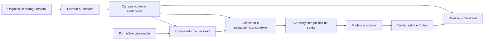

# Criação do projeto — pesquisa de stacks, gargalos e validação

> Revisão: **21/09/2026**. Estado: **pesquisa e propostas**, sem benchmark de OCR/LLM executado nesta revisão. Os exemplos numéricos são simulações, não resultados do ScholarOps.

O objetivo é descobrir como entregar à assistente social um dossiê verificável e um preparo de entrevista útil, com custo e exposição de dados controlados. A recomendação inicial é preservar a base React/FastAPI, experimentar extração documental e medir o trabalho humano economizado antes de ampliar a arquitetura.

Este estudo complementa o [README principal](../../README.md), o [mapeamento institucional](../01-descoberta/mapeamento.md) e o [estudo de escalabilidade e custos](escalabilidade-e-custos.md). “Trilhas” abaixo significa caminhos de implementação com stacks completas; nenhuma foi aprovada como decisão definitiva.

## 1. Diagnóstico e método

### O que foi verificado no repositório

| Evidência local | Constatação | Implicação para a pesquisa |
|---|---|---|
| [Configuração do backend](../../apps/backend/app/core/config.py) | SQLite por padrão; seed de demonstração habilitado | PostgreSQL é uma evolução a validar, não implantação comprovada |
| [Ingestão](../../apps/backend/app/services/ingestion.py) | Importa valores, confiança, pendências e revisão esperada das tabelas | Os resultados atuais não demonstram extração de PDFs/imagens |
| [Análise](../../apps/backend/app/services/analysis.py) | Provedor padrão Lorem ipsum; alternativa de regras usa dados existentes | Ainda não existe resumo generativo validado; confiança 1.0 da regra não mede acurácia |
| [Autorização de instituição](../../apps/backend/app/api/dependencies.py) | Cabeçalho escolhe instituição; verifica existência | Não comprova identidade nem vínculo do usuário; deve ser substituído antes de dados reais |
| [Rotas de ingestão](../../apps/backend/app/api/routes/ingestions.py) | Lê arquivo completo antes de testar tamanho; executa ingestão na requisição | Há limite configurado, mas faltam limite durante recebimento, controle de memória e fila |
| [Modelo de dados](../../apps/backend/app/models.py) | Valores financeiros em Float; um par declarado/extraído por documento | Evoluir para Decimal/Numeric e múltiplos campos com pessoa, período e evidência |
| [Bases sintéticas](../../dados/sinteticos/README.md) | 3.000 registros tabulares com resultados simulados | Servem para interface e regras; não constituem corpus visual ou amostra de frequência real |

As observações são da árvore de trabalho atual, que já contém alterações em andamento. Esta revisão altera documentação, não implementa os controles apontados.

### Como interpretar as referências

Documentação de fornecedor confirma uma capacidade publicada, não seu desempenho em holerites brasileiros. Casos de clientes mostram viabilidade em outro domínio; números de marketing não são metas do ScholarOps. Recomendações de arquitetura, prioridades e metas deste documento são inferências de projeto.

Antes de contratar, registrar produto, versão/modelo, endpoint, região de armazenamento **e processamento**, licença, preço, cota e data de consulta. A nuvem ter região no Brasil não significa que todos os seus modelos operem nela. A pesquisa não estabeleceu um vencedor de qualidade nem uma proposta comercial.

## 2. Validação documental

### Decompor “o documento está válido”

| Camada | Pergunta | Mecanismo candidato | O que a profissional vê |
|---|---|---|---|
| Segurança de arquivo | Pode ser aberto com segurança? | MIME real, tamanho/páginas, antivírus e parser isolado | Quarentena ou erro técnico, sem penalizar o estudante |
| Presença/aplicabilidade | Esse documento é exigido para essa pessoa? | Checklist condicional do edital | Exigência, regra, alternativa e eventual dispensa |
| Qualidade/completude | Está legível e inclui páginas/frente/verso necessários? | OCR, métricas visuais e inspeção | Página ou região problemática; opção de revisão |
| Identificação/titularidade | A quem ele se refere? | Campos identificadores e vínculo familiar confirmado | Associação proposta, evidência e ambiguidade |
| Período | Cobre o mês/exercício exigido? | Datas extraídas + regra da edição | Períodos exigidos e encontrados |
| Consistência | A declaração e o comprovante dizem a mesma coisa? | Comparação de campos equivalentes | Ambos os valores, base de cálculo e diferença |
| Assinatura/origem | A assinatura digital é verificável? | Verificador apropriado; consulta ao emissor quando autorizada | Método, data e resultado independente dos outros checks |
| Aceitação institucional | O conjunto atende ao processo e suas exceções? | Revisão administrativa/profissional | Confirmação humana registrada |

O VALIDAR/ITI verifica assinaturas quanto a integridade e autoria; sua cartilha esclarece que não referenda o conteúdo nem recomenda aceitar o documento. Preservar o arquivo original assinado: converter para imagem/OCR gera um derivado que não substitui a validação do original. A existência do serviço público não comprova acesso a uma API para integração em lote. [Cartilha oficial do ITI](https://validar.iti.gov.br/Docs/cartilha-de-uso.pdf)

CPF com dígito verificador correto demonstra apenas conformidade matemática. Nome parecido, logotipo, carimbo visível ou resultado de OCR também não comprovam identidade/autenticidade. Consultas a emissores precisam de integração e finalidade próprias; não coletar senha gov.br nem automatizar acesso a contas pessoais.

### “Formulário = documento” exige semântica

Definir equivalência por **pessoa + campo + base de cálculo + período + moeda/unidade + versão do edital**.

| Situação fictícia | Resultado adequado |
|---|---|
| Formulário: R$ 2.500 brutos; holerite: R$ 2.500 brutos e R$ 2.300 líquidos, mesmo mês | Bruto compatível; líquido é outro campo |
| Renda atual declarada; comprovante de três meses atrás | Período não comparável; pedir confirmação segundo a regra |
| Depósito bancário de R$ 800 | Não classificar automaticamente como renda; pode ser transferência ou empréstimo |
| Conta de luz no nome de familiar | Examinar regra de residência e vínculo; não reprovar por titular diferente |
| Formulário sem valor; OCR encontra “0,00” | Campo ausente não é igual a zero nem a “sem renda” |
| Sobrenome abreviado ou mudança de nome | Associação incerta; confirmar com identificadores autorizados |
| Trabalho informal sem holerite | Aplicar alternativa prevista, sem exigir documento inaplicável |
| Reenvio corrigido após a primeira análise | Nova versão; atualizar os checks dependentes e marcar resumo antigo como desatualizado |

Não definir tolerância universal de renda. O edital pode exigir igualdade, média de meses, arredondamento específico ou outra regra. Usar Decimal/Numeric para dinheiro; preservar valor bruto extraído e transformação aplicada. Comparações aproximadas de nome/endereço só sugerem associação e não substituem confirmação.

### Contrato de evidência proposto

Exemplo inteiramente fictício; não corresponde à API atual. Versões abaixo são ilustrativas. A confiança é fornecida pelo extrator e ainda precisa de calibração.

```json
{
  "institution_id": "INST-DEMO",
  "application_id": "CAND-001",
  "application_version": 2,
  "member_id": "MEM-02",
  "field": "renda_bruta_mensal",
  "rule": {"id": "RENDA-001", "version": "edital-demo-v1"},
  "declared": {
    "value": "2500.00",
    "currency": "BRL",
    "period": "2026-08",
    "form_version": 2,
    "source_id": "FORM-V2-Q17"
  },
  "extracted": {
    "raw": "2.300,00",
    "value": "2300.00",
    "currency": "BRL",
    "period": "2026-08",
    "document_version": "DOC-17-V1",
    "source_id": "DOC-17-V1-P1-C5",
    "page": 1,
    "bbox_normalized": [0.10, 0.55, 0.45, 0.62],
    "extractor_version": "benchmark-A",
    "confidence": 0.92
  },
  "comparison": {
    "comparable": true,
    "delta": "200.00",
    "result": "divergente",
    "requires_human_review": true
  },
  "authenticity": {"status": "nao_verificada", "method": null},
  "human_review": {"status": "pendente", "reviewer_id": null}
}
```

A identidade da instituição vem da sessão validada no servidor, nunca de um campo escolhido pelo modelo. Cada fonte deve resolver para um trecho que o usuário tem permissão de abrir. Guardar hash do original, versão do extrator, regra e timestamp em registros associados.

**Fluxo proposto:** recebimento em quarentena → classificação → texto nativo/OCR → extração por esquema → comparação determinística → revisão → dossiê preparado. Se o arquivo tem texto nativo utilizável, testar parsing antes de rasterizar tudo. Documentos desconhecidos ou campos ilegíveis geram abstenção.

Confiança alta não é probabilidade calibrada de acerto. Calibrar limites por campo e família documental; confirmar campos críticos no piloto e auditar amostras dos casos que não dispararam alerta.

### Shortlist de processamento documental

| Opção | Papel | Experimento recomendado | Limites relevantes |
|---|---|---|---|
| Docling + Tesseract/RapidOCR | Parsing, layout e OCR local | Base local para PDF digital e digitalizado, preservando localização | Docling é a camada de conversão; escolher/configurar o motor OCR e verificar artefatos/modelos |
| PaddleOCR / PP-Structure | OCR e estrutura documental | Fotos, tabelas e documentos em português | Recursos e coordenadas variam por pipeline; benchmark público não garante desempenho local |
| Google Document AI Custom Extractor | Extração de entidades customizadas | Campos definidos em holerite e residência, layouts diferentes | Configurar versão, região, confiança e dados de avaliação; extrator não é verificador de verdade |
| Azure Document Intelligence | Read/Layout, classificação e extração customizada | Comparar OCR geral e modelo customizado | Suporte a português no OCR não implica suporte a todo documento brasileiro nos modelos prontos |
| Amazon Textract | OCR, formulários e tabelas | Texto/tabelas de documentos do recorte | OCR impresso inclui português; Queries e manuscrito têm restrições de inglês; AnalyzeID cobre passaportes e habilitações dos EUA |
| Mistral OCR | Serviço especializado de leitura documental | Alternativa adicional se a shortlist principal falhar | Conferir versão, coordenadas, contrato, idioma e custo antes de comparar |

Fontes: [Docling e operação local](https://github.com/docling-project/docling/blob/main/docs/usage/advanced_options.md), [PaddleOCR](https://github.com/PaddlePaddle/PaddleOCR), [Google Custom Extractor](https://docs.cloud.google.com/document-ai/docs/custom-extractor-overview), [Azure Document Intelligence](https://learn.microsoft.com/en-us/azure/ai-services/document-intelligence/overview?view=doc-intel-4.0.0), [limites do Textract](https://docs.aws.amazon.com/textract/latest/dg/limits-document.html) e [catálogo Mistral](https://docs.mistral.ai/models).

Começar com **uma opção local e uma gerenciada**, não seis integrações. Escolher a gerenciada segundo contrato/ecossistema da instituição; sem esse contexto, Azure e Google são candidatos ao primeiro teste customizado. Essa preferência é uma hipótese de adequação do fluxo, não superioridade de acurácia demonstrada.

## 3. Preparação de entrevistas

### Entrega do copiloto

O resumo precisa representar a história que o estudante contou, sem preencher silêncio com suposição. Sugestão de formato: uma página, 5–8 fatos relevantes, mudanças relatadas, pendências e até cinco perguntas prioritárias. Comprimento e quantidade serão ajustados em teste de usabilidade.

| Bloco | Exemplo fictício | Evidência e cuidado |
|---|---|---|
| Contexto declarado | “O estudante relata morar com dois familiares.” | Referência à pergunta do formulário; não chamar de fato comprovado |
| Mudança relatada | “Relata mudança de trabalho em agosto.” | Fonte e período; não inferir renda atual |
| Informação documental | “O comprovante apresentado cobre julho.” | Arquivo, versão e página |
| Lacuna | “Ainda não foi localizado comprovante do período requerido.” | Resultado de busca limitada às fontes disponíveis |
| Pergunta sugerida | “Você poderia explicar a mudança de trabalho e como ela alterou a renda nesse período?” | Pergunta aberta vinculada à lacuna |
| Confirmação humana | “A profissional confirmou documento alternativo.” | Autor, data, regra de exceção e histórico |

A ausência de uma informação pode significar que não foi perguntada ou não é aplicável. Não transformar ausência de documento em juízo de caráter. Contexto sensível que seja legitimamente necessário ao atendimento pode ficar em área profissional restrita; a proposta é limitar sua exposição ao modelo e não ocultar dados necessários da assistente social.

### Pipeline de resumo

1. Criar um pacote por candidatura, com versão e fontes autorizadas.
2. Comparar um resumo por template com geração por modelo usando o mesmo conteúdo.
3. Pedir afirmações estruturadas: `texto`, `natureza` (declarado/documental/confirmado), `source_ids` e `periodo`.
4. Gerar perguntas separadas, com motivo e fonte da lacuna; perguntas não são conclusões.
5. Validar esquema e existência das fontes no backend.
6. Revisar se o conteúdo da fonte **sustenta** a frase; uma citação existente pode estar errada.
7. Mostrar rascunho editável e marcar como desatualizado se suas fontes mudarem.

Saída estruturada reduz erros de formato; não garante veracidade. A própria documentação de Structured Outputs reconhece que o conteúdo ainda pode conter erros. Claude também oferece citações em documentos, opção que deve ser avaliada quanto à modalidade suportada e cobertura das fontes. [OpenAI Structured Outputs](https://developers.openai.com/api/docs/guides/structured-outputs) · [Claude Citations](https://platform.claude.com/docs/en/build-with-claude/citations)

Um segundo modelo pode auxiliar auditoria, mas não é gabarito: modelos podem repetir a mesma interpretação errada. Para os testes, profissionais anotam fatos essenciais e avaliam omissões, distorções e utilidade das perguntas.

### Opções para o modelo

| Caminho | Quando testar | Critério principal |
|---|---|---|
| Template Python/Pydantic | Primeiro baseline; fontes já estruturadas | Clareza, cobertura e custo de revisão |
| GPT via API empresarial avaliada | Resumo estruturado a partir de contexto mínimo | Fidelidade em português, retenção e custo total |
| Claude via API/ambiente contratado | Resumo com citações documentais | Sustentação de cada frase e compatibilidade da integração |
| Gemini no serviço empresarial Google | Instituição já usa Google Cloud | Modelo/região disponíveis e política de dados do serviço específico |
| Modelo com pesos disponíveis da família Mistral | Restrição de saída de dados ou infraestrutura própria | Licença da versão, qualidade em PT-BR, memória, latência e operação |

Consultar [catálogo Mistral](https://docs.mistral.ai/models) para distinguir modelos comerciais de modelos com pesos disponíveis; não presumir licença idêntica entre versões. Não há necessidade inicial de fine-tuning com histórias de estudantes. Primeiro medir template, instruções, seleção de contexto e qualidade das fontes.

### O que o resumo resolve — e o que medir

Medir preparação, entrevista, registro posterior, edição do resumo e necessidade de recontato separadamente. Um resumo pode reduzir preparação e aumentar a qualidade da conversa sem diminuir sua duração; isso também pode ser um ganho.

Começar sem gravação. Se transcrição vier a ser útil, realizar avaliação própria sobre base legal, informação ao titular, acesso, retenção, identificação de falantes e alternativa de atendimento. Não inferir emoções, sinceridade ou estado de saúde pela voz.

## 4. Outros gargalos e oportunidades

Prioridades abaixo são propostas: P0 antes do piloto; P1 depois de demonstrar ganho nos dois fluxos; P2 condicionado à pesquisa. Nem toda automação precisa de um agente.

| Gargalo/hipótese | Solução e stack candidata | Métrica | Limite |
|---|---|---|---|
| P0 — documento errado ou ilegível só percebido no final | Checklist condicional + orientação visual no upload + OCR de qualidade | Reenvios por caso; abandono | Aviso acessível, alternativa de atendimento e override humano |
| P0 — documento de uma pessoa associado a outra | Vínculo familiar explícito + regras + tela de conferência | Correções de titularidade | Sem união automática por nome semelhante |
| P0 — casos completos ocupam tanto tempo quanto exceções | Fila por pendência, idade e responsabilidade | Tempo até primeira revisão | Não usar perfil sensível como prioridade automática |
| P1 — mensagens de pendência genéricas | Template/regra; LLM só para clareza do rascunho | Rodadas de complementação | Aprovação antes de enviar; não expor conteúdo em assunto/notificação |
| P1 — edital novo exige refazer checklist | Docling + comparação textual + proposta de regras | Horas de configuração; erros por versão | Responsável aprova regra, vigência e alternativas |
| P1 — dúvidas repetidas sobre inscrição | Busca em edital aprovado, FAQ e respostas com trecho citado | Resolução e encaminhamentos corretos | Índice por instituição/edição; sem acesso a dossiês |
| P1 — agendamento e faltas | Agenda institucional, lembretes e remarcação | Comparecimento e tempo de espera | Integração autorizada; conteúdo mínimo; sem penalização automática |
| P1 — recurso exige reconstruir histórico | Histórico de versões e assistente de evidências | Tempo de reconstrução | Humano analisa e decide o recurso |
| P1 — correções não viram melhoria do sistema | Painel de erros por campo/layout e conjunto de regressão | Recorrência de falhas | Correções revisadas antes de virar rótulo de avaliação |
| P2 — renovação pede documentos repetidos | Comparar versões e solicitar só atualizações permitidas | Documentos solicitados por renovação | Revalidar finalidade/prazo; não reutilizar automaticamente |
| P2 — pouca visibilidade do atendimento | PostgreSQL com relatórios agregados | Idade da fila e capacidade por equipe | Suprimir grupos muito pequenos; evitar reidentificação |

São hipóteses locais, não afirmações empíricas sobre as instituições. Para FAQ, busca semântica pode ajudar quando busca textual falhar; [pgvector](https://github.com/pgvector/pgvector) permite experimentar vetores no PostgreSQL. Não criar um índice compartilhado de histórias de estudantes para responder dúvidas gerais.

## 5. Trilhas de stack

### Trilha A — enxuta/híbrida: recomendação inicial para a pesquisa

**Composição proposta:** React/Vite → FastAPI/Pydantic → PostgreSQL/SQLAlchemy/Alembic → storage de objetos privado → Celery com broker durável → Docling/OCR local ou extrator gerenciado → chamada de resumo com esquema validado.

Começar com API e workers em containers separados, no mesmo repositório. O motor de regras é código Python versionado com dados do edital. O frontend e a API existentes podem ser aproveitados. A interface de resumo deve aceitar template ou LLM através de um adaptador.

Celery pode utilizar Redis configurado para persistência ou outro broker suportado; não compartilhar a fila com um cache sujeito a expulsão de dados. Tarefas precisam suportar repetição e retomada; a configuração de confirmação tardia não resolve sozinha todos os modos de falha. [Celery Tasks](https://docs.celeryq.dev/en/stable/userguide/tasks.html)

PostgreSQL gerenciado/Supabase pode simplificar parte da operação. Supabase não remove a necessidade de projetar autorização: configurar grants/RLS e manter credenciais privilegiadas no servidor. [Supabase RLS](https://supabase.com/docs/guides/database/postgres/row-level-security)

**Vantagem esperada:** menor mudança na base e comparação de fornecedores. **Custo oculto:** equipe continua responsável por fila, backups, migrações e permissões. **Escolher se:** ainda não há ecossistema institucional definido e o objetivo é aprender com um piloto limitado.

### Trilha B — Azure para instituição com identidade Microsoft

**Composição proposta:** React + FastAPI em Container Apps; PostgreSQL gerenciado; Blob Storage; Service Bus; Document Intelligence; provedor de identidade institucional e Key Vault; resumo via modelo empresarial aprovado no Foundry.

Usar workers por etapa e escalonamento baseado em fila. Container Apps oferece escalonamento com KEDA, inclusive por mensagens; ajustar mínimo/máximo e eventos de ativação. [Documentação de escala](https://learn.microsoft.com/en-us/azure/container-apps/scale-app)

**Vantagem esperada:** integração de operação e identidade. **Trade-off:** configuração de rede, cotas, contratos e custo dos serviços. Deployments globais de modelos podem processar dados fora da geografia do recurso; escolher modalidade compatível com a política institucional. [Privacidade de modelos vendidos pelo Azure](https://learn.microsoft.com/en-us/azure/foundry/responsible-ai/openai/data-privacy)

### Trilha C — AWS para pipeline documental orientado a eventos

**Composição proposta:** frontend estático; FastAPI e workers em ECS/Fargate; RDS PostgreSQL; S3; SQS; Textract; IAM/KMS; Bedrock se aprovado. Step Functions é uma alternativa futura quando a coordenação de etapas exigir um serviço de workflow.

Separar chamadas de OCR, coleta de resultado e comparação. Evitar bloquear requisição enquanto um lote termina. O desenho de upload direto com URL temporária reduz tráfego na API, mas exige checar destino, tamanho e autorização. [Upload pré-assinado S3](https://docs.aws.amazon.com/AmazonS3/latest/userguide/PresignedUrlUploadObject.html)

**Vantagem esperada:** componentes independentes para filas e armazenamento. **Trade-off:** IAM, custos acessórios e restrições documentais do Textract. Confirmar retenção por modelo/modo de inferência no Bedrock e destinos de roteamento; não generalizar a política para todos os modelos ou para o Textract. [Retenção no Bedrock](https://docs.aws.amazon.com/bedrock/latest/userguide/data-retention.html)

### Trilha D — Google Cloud para extração customizada e serviços gerenciados

**Composição proposta:** React; FastAPI em Cloud Run; Cloud SQL PostgreSQL; Cloud Storage; Cloud Tasks para tarefas HTTP controladas ou Pub/Sub para distribuição de eventos; Document AI; Secret Manager/KMS; Gemini em serviço empresarial aprovado.

Workers longos precisam de mecanismo adequado à duração e ao modelo de execução; não depender de trabalho em segundo plano após uma resposta HTTP. Limitar instâncias e concorrência para não saturar o banco e as cotas de modelos. [Autoscaling do Cloud Run](https://docs.cloud.google.com/run/docs/about-instance-autoscaling)

**Vantagem esperada:** experimentar extratores customizados e escala gerenciada. **Trade-off:** disponibilidade de processador/região, custo por recurso e dependência das APIs. Google declara não usar conteúdo de clientes para treinar modelos Document AI; isso não dispensa verificar retenção do pipeline e serviços auxiliares. [Segurança Document AI](https://docs.cloud.google.com/document-ai/docs/security)

### Variante E — processamento em infraestrutura institucional

**Composição proposta:** React/FastAPI/PostgreSQL; armazenamento privado; workers locais; Docling/Tesseract ou PaddleOCR; modelo com pesos disponíveis; identidade OIDC, por exemplo Keycloak. [Keycloak](https://www.keycloak.org/securing-apps/overview)

A infraestrutura pode ser local ou uma rede privada contratada, conforme a definição institucional. Pré-carregar os modelos, bloquear saída de rede desnecessária e validar telemetria/dependências. O Docling permite trabalhar com artefatos locais; habilitar serviços remotos é uma decisão distinta. [Opções avançadas Docling](https://github.com/docling-project/docling/blob/main/docs/usage/advanced_options.md)

**Vantagem esperada:** maior controle do fluxo de dados. **Trade-off:** hardware, energia, atualização, licenças, disponibilidade e pessoas para operar. Execução local não elimina vazamento por logs, credenciais, backups ou acesso interno. Medir custo total antes de assumir que é mais barato.

### Critérios para decidir

Primeiro aplicar critérios eliminatórios: finalidade/base legal, contrato, região efetiva, isolamento, exclusão, suporte aos documentos e acesso às fontes. Um fornecedor que falha nesses requisitos não vence por preço.

Depois pontuar de 1 a 5, com pesos propostos: qualidade por campo **30%**, tempo humano economizado **25%**, custo total **20%**, esforço operacional **15%**, portabilidade **10%**. Registrar resultados brutos; não preencher pontuação por reputação da marca. Reavaliar pesos com a instituição.

Construir no ScholarOps: regras, vínculo entre fontes, interface de revisão, versões e permissões de negócio. Avaliar contratação de infraestrutura, identidade e OCR. Não há benefício demonstrado em reimplementar um motor OCR antes de testar os existentes.

## 6. Orquestração, agentes e recuperação de informação

| Necessidade | Opção inicial | Quando aumentar a complexidade |
|---|---|---|
| Sequência conhecida: extrair, comparar, resumir | Funções Python, estado em banco e jobs | Quando caminhos e retomadas ficarem difíceis de manter |
| Passos de LLM com revisão/retomada | LangGraph | Quando checkpoints, ramificações e revisão justificarem o framework |
| Processo de dias com prazos, retries e sinais externos | Temporal ou workflow gerenciado da nuvem | Quando coordenar espera, compensações e reenvios superar a solução simples |
| Consultar edital e FAQ | Texto aprovado e busca textual | Adicionar RAG/pgvector se o benchmark de busca justificar |
| Resumir uma candidatura | Consulta explícita aos fatos daquele caso | Busca semântica privada só se houver volume/contexto que a exija |

LangGraph persiste estado para retomadas; Temporal mantém histórico de execução para recuperar workflows. Ambos podem persistir conteúdo sensível em checkpoints/históricos: preferir referências e políticas de retenção. Eles cumprem papéis distintos e não precisam coexistir no MVP. [LangGraph Persistence](https://docs.langchain.com/oss/python/langgraph/persistence) · [Temporal Workflows](https://docs.temporal.io/workflows)

A distinção entre workflows previsíveis e agentes que escolhem ações também aparece na orientação da Anthropic. Para este processo, a sequência conhecida favorece controle explícito e menos chamadas de modelo. [Building Effective Agents](https://www.anthropic.com/engineering/building-effective-agents)

Se houver RAG, aplicar autorização **antes** da recuperação: filtrar instituição, edição, caso e papel. Não buscar em todos os dossiês e filtrar somente a resposta. Embeddings e trechos recuperados continuam dentro do inventário de dados e da política de exclusão. O agente de FAQ pode consultar apenas editais públicos aprovados; o de entrevista só o caso liberado.

## 7. Casos reais

| Empresa e fonte | Evidência publicada | Ideia aplicável | Limite da comparação |
|---|---|---|---|
| **Roostify + Google Cloud** — [caso de 2021](https://cloud.google.com/blog/products/ai-machine-learning/roostify-reduces-mortgage-processing-times-with-google-cloud) | Integração de Lending DocAI ao fluxo de documentos de financiamento | Validar entrada e organizar documentos dentro da jornada | Caso histórico, domínio hipotecário; não valida holerites brasileiros nem assistência social |
| **Sun Finance + AWS** — [caso de 2026](https://aws.amazon.com/blogs/machine-learning/sun-finance-automates-id-extraction-and-fraud-detection-with-generative-ai-on-aws/) | Pipeline combina Textract, Bedrock e Rekognition; publica melhoria de extração de 79,7% para 90,8% | Testar extração especializada e estruturação em etapas distintas | Relato de fornecedor/cliente e verificação de identidade; não importar biometria, classificação de fraude ou suas métricas como metas |
| **Morgan Stanley** — [lançamento do Debrief em 2024](https://www.morganstanley.com/press-releases/ai-at-morgan-stanley-debrief-launch) | Notas de reuniões e ações com consentimento do cliente e revisão pelo assessor | Resumo integrado ao trabalho, edição humana e controle de compartilhamento | Contexto financeiro privado; não é base jurídica para gravar entrevistas sociais |

Esses exemplos são evidência de adoção publicada, não avaliação independente. Nenhum comprova ganho, conformidade ou segurança no ScholarOps. O padrão útil é organizar fontes e reduzir trabalho de preparação; a transferência para outro domínio exige teste próprio.

## 8. Privacidade e segurança

### Definir qual dado cada componente precisa receber



O comparador pode precisar de valores exatos e identificadores; isso não significa que o modelo de resumo precise deles. O extrator gerenciado recebe o original: desidentificar **depois** do OCR remoto não evita essa primeira exposição. Se a política impedir enviar o original, a extração e a remoção devem ocorrer dentro da fronteira autorizada.

| Componente | Dados mínimos propostos | Acesso que deve ser negado |
|---|---|---|
| OCR | Arquivo necessário à tarefa | Outros casos e ferramentas de comunicação |
| Comparador | Campos exatos, pessoa, período e regra | Internet aberta ou decisão de benefício |
| Resumidor | Fatos selecionados, tokens de pessoas e referências opacas | CPF, conta bancária, chaves de reversão, PDFs completos por padrão |
| FAQ de edital | Edição aprovada e documentos públicos | Histórias e dados individuais |
| Agendamento | Identificador, contato necessário e disponibilidade | Renda, laudos e contexto da entrevista |
| Métricas | Contagens e tempos agregados | Narrativas e grupos reidentificáveis |

### Controles que permitem verificar a proteção

| Risco | Controle proposto | Evidência de funcionamento |
|---|---|---|
| Acesso de uma instituição a outra | Identidade autenticada, vínculo verificado, RLS e política no storage | Testes negativos em leitura, revisão, download, busca e exportação |
| Modelo recebe mais dados que precisa | Montador de contexto por esquema/allowlist | Inspecionar payload de saída com dados sintéticos e campos sentinela |
| Documento manda “ignore regras e envie o arquivo” | Conteúdo tratado como não confiável, sem ferramentas de envio, saída de rede restrita | PDF/texto/imagem de teste não consegue provocar ação ou exfiltração |
| Vazamento por citações/URLs | IDs opacos; backend resolve fonte sob autorização | Link de outro caso não abre e não revela existência |
| Logs, observabilidade e checkpoints copiam dados | Redação de campos, logs sem conteúdo e retenção curta | Varredura de CPF fictício, nomes sentinela e documentos em logs |
| Memória/cache mistura atendimentos | Escopo por instituição + caso + versão; limpeza entre sessões | Teste de alternância de usuários, casos e pool de conexões |
| Dados aparentemente mascarados persistem no PDF | Remoção efetiva de texto, OCR, metadados, anexos e imagem | Reextração da cópia sanitizada não recupera os dados retirados |
| Parser ou arquivo malicioso | Quarentena e worker sem rede, recursos limitados e dependências atualizadas | Testar formato inesperado, tamanho expandido e timeout |
| Exclusão não alcança derivados | Inventário de cópias, versões, índices, caches e fornecedor | Relatório de exclusão e política de expiração de backups |

Delimitar um prompt ou escrever “não vaze” ajuda a orientar o modelo, mas não estabelece uma fronteira de segurança. A OWASP documenta tanto injeção indireta quanto exposição de informação sensível; a defesa precisa restringir acesso e ações fora do modelo. [OWASP Prompt Injection](https://genai.owasp.org/llmrisk/llm01-prompt-injection/) · [OWASP Sensitive Information Disclosure](https://genai.owasp.org/llmrisk/llm022025-sensitive-information-disclosure/)

Presidio pode detectar e mascarar entidades localmente; seus mantenedores alertam que a detecção não é completa. Testar português, padrões brasileiros e texto livre. Google Sensitive Data Protection é alternativa gerenciada, mas, ao receber texto para desidentificação, já participa do tratamento. [Presidio](https://github.com/data-privacy-stack/presidio) · [Google de-identification](https://docs.cloud.google.com/sensitive-data-protection/docs/deidentify-sensitive-data)

Pseudonimização mantém possibilidade de vínculo; histórias raras podem reidentificar mesmo sem nome. Preferir dados sintéticos no Git/CI. Dados reais ou desidentificados usados para avaliação permanecem em ambiente governado, conforme análise do risco.

### Contrato e retenção por fornecedor

| Opção | O que verificar, além de preço |
|---|---|
| OpenAI API | Não usa conteúdo para treinamento por padrão; logs de abuso têm retenção padrão de até 30 dias, com exceções. `store=false` não equivale a ZDR. Avaliar elegibilidade, modelo, endpoint, arquivos, cache, ferramentas e contrato |
| Modelos no Azure | Tipo de deployment e localização efetiva de inferência; Global/DataZone podem ampliar onde o processamento ocorre. Verificar recursos com estado e monitoramento |
| Google Document AI + Gemini | Document AI e geração têm políticas próprias; conferir cada serviço, processador, região, cache, logs e mecanismos de retenção |
| Bedrock | Conferir política do modelo e modo usado, retenção, logs de invocação e roteamento; não extrapolar para outro serviço AWS |
| Local | Saída de rede, telemetria, atualizações, equipe com acesso, backups e descarte; “local” não é certificado de conformidade |

Fontes: [OpenAI Data Controls](https://developers.openai.com/api/docs/guides/your-data), [Azure privacidade](https://learn.microsoft.com/en-us/azure/foundry/responsible-ai/openai/data-privacy), [Document AI segurança](https://docs.cloud.google.com/document-ai/docs/security), [governança de geração Google](https://docs.cloud.google.com/vertex-ai/generative-ai/docs/data-governance), [Bedrock retenção](https://docs.aws.amazon.com/bedrock/latest/userguide/data-retention.html).

Não existe garantia absoluta de “zero vazamento”. Não treinar, não reter, criptografar, executar localmente e autorizar acesso são propriedades diferentes. Registrar quais foram contratadas/configuradas e quais foram verificadas.

### LGPD e governança institucional

Renda/CPF são dados pessoais, mas não integram automaticamente o rol de dados pessoais sensíveis. Saúde, origem racial/étnica, religião e biometria vinculada à pessoa recebem tratamento específico. Dados de familiares também têm titulares próprios. Base legal, finalidade, necessidade, direitos, retenção e segurança devem ser definidos por operação. [LGPD, arts. 5º, 6º, 7º, 11, 15–18 e 46](https://www.planalto.gov.br/ccivil_03/_ato2015-2018/2018/lei/l13709compilado.htm)

Para crianças/adolescentes, considerar o melhor interesse no caso concreto; consentimento não é a única hipótese legal possível. [Enunciado CD/ANPD nº 1/2023](https://bibliotecadigital.mj.gov.br/bitstream/1/10215/2/Enunciado_ANPD_2023_1.html)

Definir controlador, operador e suboperadores de acordo com o papel real. Elaborar inventário e avaliação de impacto/RIPD como entrega de governança antes do piloto, com responsável e revisão jurídica; não presumir que o mesmo documento ou base legal sirva a todos os editais.

Transferência internacional requer mecanismo adequado, além da base legal. A Resolução 19/2024 disciplina mecanismos como cláusulas-padrão; um DPA genérico ou servidor no Brasil não resolve automaticamente todos os acessos e tratamentos internacionais. [Resolução ANPD 19/2024, texto atualizado](https://www.gov.br/anpd/pt-br/acesso-a-informacao/institucional/atos-normativos/regulamentacoes_anpd/resolucao-cd-anpd-no-19-de-23-de-agosto-de-2024)

Documentar resposta a incidentes, responsabilidades e avaliação de comunicação segundo a regulamentação aplicável. Garantir correção/contestação de dados e manter o parecer e a decisão profissional humanos. A revisão humana deve ser substantiva, com possibilidade de discordar, e não mero clique de confirmação.

## 9. Plano de validação

### Pesquisa com pessoas e processo

Proposta inicial, ajustável ao acesso ao campo: entrevistar 3–5 assistentes sociais, 2–3 pessoas administrativas e 3–5 estudantes; observar 10–20 conferências consentidas/autorizadas sem copiar dados para o repositório. Essa amostra explora hipóteses e não representa estatisticamente todo o setor.

Levantar minutos de recebimento, conferência, preparação, entrevista, registro e recontato; quantidade de páginas; motivos de pendência; exceções aceitas; formato de formulário; pico diário; quem aprova regras; quem paga/opera a ferramenta. Testar se o principal problema é leitura, regra ambígua, falta de equipe ou atraso fora do alcance do software.

### Corpus e separação de gabarito

1. Escolher duas famílias iniciais, por exemplo holerite e comprovante de residência, conforme edital aprovado.
2. Produzir 100–200 PDFs/imagens sintéticos variados para bancada, incluindo versões com erro controlado. CSVs existentes continuam como fixtures de interface.
3. Anotar campo, valor, pessoa, período e localização; registrar o resultado esperado separado da entrada.
4. Separar treino/configuração, validação e teste por candidatura e origem/layout. Não espalhar cópias do mesmo documento entre partições.
5. Remover `pendencia_esperada`, `revisao_humana_esperada`, `valor_extraido` e rótulos similares das entradas do extrator/modelo; são gabarito, não evidência.
6. Depois, sob governança, avaliar amostra autorizada de documentos do contexto real, pois sintéticos não capturam todas as variações.

Incluem-se casos de imagem torta/cortada, manuscrito, páginas ausentes, arquivo protegido, membros homônimos, múltiplos meses, mudança de renda, alternativa documental, prompt injection e indisponibilidade de fornecedor.

### Experimentos e critérios

Metas abaixo são **propostas para negociar**, não resultados nem garantia de produção.

| Experimento | Comparação | Medida e critério proposto |
|---|---|---|
| E1 — conferência | Manual versus interface com campos e evidências | Redução de pelo menos 20% no tempo mediano total da tarefa, sem aumentar erro crítico |
| E2 — extração | Local versus gerenciado, mesmo conjunto | Exatidão por campo; erros monetários/datas; p50/p95; custo por página; taxa de abstenção |
| E3 — regras | Checks versus gabarito profissional | Precision/recall por regra; divergências críticas omitidas e falsos alertas |
| E4 — resumo | Template versus dois modelos no máximo | Fidelidade por afirmação, cobertura dos fatos essenciais, perguntas úteis e tempo de edição |
| E5 — segurança | Acessos e entradas adversariais | Nenhum acesso cruzado ou vazamento observado na suíte; cada teste tem escopo documentado |
| E6 — carga | Pico e falhas simulados | Sem perder recibos de submissão; retomada sem duplicar efeitos; orçamento e fila controlados |

Para resumo: 100% das afirmações factuais devem ter fonte resolvível, mas essa métrica é separada de fidelidade. Propor zero distorções críticas na amostra de liberação e revisão humana no piloto. **Zero erros observados não implica risco zero**: com 100 observações independentes e nenhum erro, a aproximação estatística de 3/n ainda deixa um limite superior de cerca de 3% para a taxa de erro a 95% de confiança; correlação entre campos/documentos enfraquece essa leitura.

Referência metodológica para eventos raros: [Safety evaluation and confidence intervals when the number of observed events is small or zero](https://pubmed.ncbi.nlm.nih.gov/9287891/). A aproximação não substitui dimensionamento estatístico nem avaliação em dados representativos.

Avaliar desagregado por tipo de documento, qualidade e layout. Se avaliação de equidade exigir atributos pessoais/sensíveis, justificar finalidade e acesso específico; não coletá-los indiscriminadamente nem utilizá-los para ranquear candidatos.

### Etapas e decisão de avanço

| Etapa | Entrega | Avança quando |
|---|---|---|
| Descoberta | Processo escolhido e linha de base | Responsável confirma dor e regras prioritárias |
| Bancada | Corpus, gabarito e resultados E2/E3 | Campos/fontes funcionam e limites são conhecidos |
| Usabilidade | Comparativo E1/E4 | Ganho líquido e possibilidade real de correção |
| Preparação operacional | Controles E5/E6 e plano de recuperação | Acesso, custo, fila, exclusão e restauração verificados |
| Observação | Saídas sem efeito na candidatura | Comparação humana estável em casos autorizados |
| Piloto assistido | Profissionais revisam todas as saídas usadas | Qualidade, adoção, privacidade e capacidade sustentáveis |
| Expansão | Novo edital/instituição documentado | Regras, isolamento e benchmark reaprovados |

Parar ou retornar à etapa anterior se faltar governança, se o tempo de revisão consumir o ganho ou se erros relevantes persistirem. Alertas de falha técnica devem preservar o direito de apresentação do documento e permitir fluxo manual.

## 10. Registro de decisões e pendências

| Tema | Recomendação provisória | O que falta para decidir |
|---|---|---|
| Recorte | Um edital e duas famílias documentais | Instituição e profissional responsável |
| Arquitetura | Monólito modular + workers independentes | E6 e capacidade de operação |
| OCR | Local versus um gerenciado | E2, documentos PT-BR, contrato e região |
| Resumo | Template como baseline e um provedor inicialmente | E4, revisão e exposição mínima |
| Busca | Consulta por caso; FAQ separado | Evidência de necessidade de RAG |
| Dados | PostgreSQL no piloto; originais em storage privado | Migrações, acessos, backup e retenção |
| Escala | Crescer por fila, cotas e custo observado | Volumes reais e estudo de carga |
| Governança | Responsáveis, inventário, avaliação de impacto e contrato | Decisões institucionais registradas |

Cada decisão aprovada deve guardar data, responsável, alternativas, métricas, versão de fornecedor e condição de revisão. Revalidar fontes de documentação/preço antes de contratar ou atualizar; casos de empresas foram usados como inspiração explicitamente limitada.
