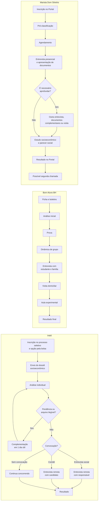

# Mapeamento dos processos atuais de seleção de bolsas

> Documento de descoberta que descreve o estado atual (`AS-IS`) dos processos do Programa de Bolsas Inteli, do Programa Bom Aluno BH e da Bolsa Social do Colégio Marista Dom Silvério. A versão foi construída a partir da pesquisa de partida fornecida pelo proponente e conferida, sempre que possível, em fontes institucionais e legais. Regras, documentos e cronogramas devem ser revistos a cada nova edição dos processos.

| Campo | Valor |
|---|---|
| Projeto | ScholarOps |
| Versão | 1.0 |
| Data da verificação | 2026-09-03 |
| Responsável | Proponente |
| Tipo de pesquisa | Pesquisa documental comparativa |
| Instituições-alvo | Inteli, Programa Bom Aluno BH e Colégio Marista Dom Silvério |
| Recorte temporal principal | Processos para ingresso/ano letivo de 2026 |

## 1. Objetivo e limites

Este documento procura responder:

1. como cada processo acontece hoje, do início ao resultado;
2. quem participa de cada etapa e quais são os canais usados;
3. quais informações e documentos entram na análise;
4. onde surgem conferência manual, pendências, inconsistências e retrabalho;
5. em quais pontos o ScholarOps pode apoiar a operação sem tomar a decisão profissional.

Os três casos não são versões do mesmo programa:

- o **Inteli** seleciona candidatos para bolsas e auxílios de permanência em cursos de graduação;
- o **Bom Aluno BH** seleciona estudantes do 6º ano de escolas públicas para um programa gratuito e continuado de formação;
- o **Marista Dom Silvério** seleciona estudantes da educação básica para bolsas sociais integrais ou parciais, no contexto da legislação aplicável às entidades beneficentes.

No Marista, este mapeamento trata da **Bolsa Social para novos estudantes em 2026**. Ela não deve ser confundida com a bolsa por rendimento acadêmico, que possui edital e critérios próprios ([MARISTA BRASIL, 2025b](https://colegiosmaristas.com.br/wp-content/uploads/2025/09/Dom-Silverio-Edital-de-Bolsa-de-Rendimento-Academico-Interno-2026.pdf)).

O documento descreve o processo público, não a totalidade da operação interna. Tempos por atividade, volume de candidaturas, ferramentas internas, responsáveis por cada controle e regras não publicadas ainda precisam ser validados em entrevistas e observação.

## 2. Método e grau de confirmação

Foram confrontadas as afirmações da pesquisa de partida com os editais e páginas oficiais disponíveis. Cada informação recebe um dos estados abaixo:

| Estado | Significado | Uso no produto |
|---|---|---|
| **Confirmado** | Consta em fonte oficial da edição ou em legislação aplicável | Pode orientar o mapeamento; deve continuar versionado por edição |
| **Parcialmente confirmado** | Parte da afirmação consta em fonte oficial, mas há detalhe ou abrangência não comprovada | Não transformar o detalhe incerto em regra automática |
| **Hipótese a validar** | Veio da pesquisa de partida, mas não foi localizada em fonte oficial pública suficiente | Levar a entrevista ou solicitar documento primário |
| **Não localizado** | Não apareceu nas fontes oficiais consultadas | Não incluir no baseline nem no motor de regras |
| **Não se aplica** | O item pertence a outro programa ou a outra parte da seleção | Manter fora do recorte |

Uma ausência na página pública não prova que a atividade não exista internamente. Ela apenas impede que seja tratada como fato nesta etapa da pesquisa.

## 3. Visão comparativa

| Dimensão | Inteli | Bom Aluno BH | Marista Dom Silvério |
|---|---|---|---|
| Processo mapeado | Programa de Bolsas Inteli — Graduação 2026 | Processo seletivo 2026 | Bolsa Social de Estudo para novos estudantes — 2026 |
| Público | Candidatos aos cursos de graduação previstos no edital | Estudantes do 6º ano, exclusivamente de escola pública | Novos estudantes da educação básica, conforme vagas por série/ano |
| Filtro econômico publicado | Até 1,5 salário mínimo per capita para bolsa integral de 100%; até 3 para bolsa parcial de 50% | Até 1 salário mínimo por pessoa; preferência por famílias no CadÚnico | Faixas legais para bolsas sociais de 100% e 50%, conforme edital e disponibilidade |
| Frequência publicada | Edição anual analisada | A cada dois anos, nos anos pares | Edição anual analisada |
| Canal inicial | Plataforma do Processo Seletivo | Envio de ficha de inscrição e boletins; canal exato não é informado na página | Portal Marista |
| Núcleo da avaliação | Documentação socioeconômica; entrevistas condicionais | Desempenho escolar, prova, dinâmica, entrevista, visita e aula experimental | Pré-classificação, entrevista presencial, documentação e estudo socioeconômico |
| Decisão/resultado | Comunicação de aprovação ou reprovação por e-mail; lista conforme cronograma | Resultado final no início de dezembro | Resultado no Portal Marista |
| Fonte primária | [Edital Inteli 2026](https://www.inteli.edu.br/wp-content/uploads/2025/08/Inteli-Edital-Processo-Seletivo-Inteli-Programa-de-Bolsas-2026_ajustado.pdf) | [Como participar](https://bomalunobh.com.br/como-participar/) | [Edital Marista nº 02/2025](https://colegiosmaristas.com.br/wp-content/uploads/2025/09/Edital-n.-02-2025_CON_COL_UBEE-DOM-SILVERIO.pdf) |

No Inteli e no Marista, as faixas de renda publicadas seguem a Lei Complementar nº 187/2021: até 1,5 salário mínimo mensal per capita para bolsa integral e até 3 salários mínimos para bolsa parcial de 50% ([BRASIL, 2021](https://www.planalto.gov.br/ccivil_03/leis/lcp/lcp187.htm)). O Bom Aluno BH publica seu próprio limite, de até 1 salário mínimo por pessoa ([BOM ALUNO BH, s.d.-a](https://bomalunobh.com.br/como-participar/)).

## 4. Fluxo geral comparado

O diagrama resume apenas as etapas confirmadas. Ele não representa duração proporcional, volume de trabalho nem integrações internas.

## 5. Processo atual — Inteli

### 5.1 Escopo e regras confirmadas

O edital analisado regula o Programa de Bolsas Inteli para ingresso na graduação em 2026. A solicitação de bolsa ocorre no ato da inscrição no processo seletivo, entre 5 de agosto e 12 de outubro de 2025. Os apoios possíveis incluem isenção total ou parcial da mensalidade, moradia, alimentação, notebook e curso de inglês. O auxílio-moradia prioriza candidatos com mais de duas horas de deslocamento por transporte público até o campus ([INTELI, 2025, itens 1.2 a 1.4](https://www.inteli.edu.br/wp-content/uploads/2025/08/Inteli-Edital-Processo-Seletivo-Inteli-Programa-de-Bolsas-2026_ajustado.pdf)).

Além do critério de renda, o candidato precisa demonstrar situação social compatível, não possuir graduação anterior, ter disponibilidade para morar em São Paulo e dedicar-se integralmente nos dois primeiros anos. O edital também prevê bolsas complementares de 75% e 25%, sujeitas aos critérios e à disponibilidade do fundo ([INTELI, 2025, itens 2 e 3](https://www.inteli.edu.br/wp-content/uploads/2025/08/Inteli-Edital-Processo-Seletivo-Inteli-Programa-de-Bolsas-2026_ajustado.pdf)).

### 5.2 Etapas operacionais

| Etapa | Entrada | Atividade atual | Saída | Canal/ator visível | Exceção ou ponto de atenção |
|---|---|---|---|---|---|
| 1. Candidatura | Dados da inscrição | Candidato seleciona a participação no programa de bolsas | Pedido de bolsa vinculado à candidatura | Plataforma; candidato | Não é permitido pedir bolsa depois de se tornar estudante ativo |
| 2. Envio documental | Informações de todas as pessoas do grupo familiar e documentos do Anexo I | Candidato envia documentos conforme composição e ocupação de cada adulto | Dossiê submetido | Plataforma; candidato/responsável | Arquivo fora do prazo, incorreto ou ilegível pode causar desclassificação |
| 3. Avaliação socioeconômica | Dossiê e formulário | Cada candidatura é analisada individualmente; rendas e patrimônio são verificados | Análise e possíveis pendências | Assistente social/equipe de bolsas | A instituição pode pedir documentos adicionais |
| 4. Regularização | Aviso de pendência | Candidato corrige o item indicado | Dossiê atualizado | E-mail e plataforma | Prazo de 1 dia útil e limite de 2 cobranças por candidato |
| 5. Entrevista social, se convocado | Análise documental e candidatura | Entrevista remota com candidato e responsável legal/financeiro | Contexto econômico, familiar, educacional e emocional validado | Assistente social | Nem todos participam; convocação é obrigatória e não há remarcação |
| 6. Comitê, se convocado | Candidatura | Entrevista remota de cerca de 30 minutos somente com o candidato | Avaliação pelo comitê | Comitê de Bolsas | Nem todos participam; quem não é convocado continua concorrendo |
| 7. Resultado e matrícula | Conjunto das análises | Comunicação do resultado e formalização | Aprovação/reprovação; contrato e matrícula | E-mail, plataforma e instituição | O edital não admite pedido de vista, recurso ou revisão |

O calendário específico da avaliação de bolsa foi: documentos de 21 a 28 de outubro de 2025; entrevistas sociais de 3 a 28 de novembro; entrevistas do comitê de 1º a 5 de dezembro; resultado em 10 de dezembro; e matrícula de 10 a 30 de dezembro de 2025 ([INTELI, 2025, item 4](https://www.inteli.edu.br/wp-content/uploads/2025/08/Inteli-Edital-Processo-Seletivo-Inteli-Programa-de-Bolsas-2026_ajustado.pdf)).

### 5.3 Matriz documental do Inteli

Todos os itens desta matriz foram consolidados do Anexo I do edital de 2026. A aplicabilidade varia conforme idade, situação residencial, patrimônio, ocupação e fontes de renda ([INTELI, 2025, Anexo I](https://www.inteli.edu.br/wp-content/uploads/2025/08/Inteli-Edital-Processo-Seletivo-Inteli-Programa-de-Bolsas-2026_ajustado.pdf)).

| Categoria | Pessoa/situação | Documentos ou evidências | Janela/regra | Conferências candidatas |
|---|---|---|---|---|
| Identificação | Candidato | RG ou CNH; CPF quando não constar no documento | Atual | Titularidade, legibilidade e correspondência com formulário |
| Identificação | Demais adultos | RG ou CNH; CPF quando necessário | Todas as pessoas com 18 anos ou mais | Presença de todos os membros declarados |
| Identificação | Menores | Documento de identidade ou certidão de nascimento | Todos os menores | Nome, filiação e data de nascimento |
| Residência | Grupo familiar | Comprovante de residência em nome do candidato ou responsável | Último mês | Endereço, titular e período |
| Situação de moradia | Imóvel próprio | IRPF ou IPTU | Conforme situação declarada | Titularidade e endereço |
| Situação de moradia | Alugado ou financiado | Comprovante do último pagamento | Último mês | Valor, endereço e recorrência |
| Situação de moradia | Posse ou cedido | Declaração de posse ou cessão | Modelo institucional | Assinatura e endereço |
| Veículo | Quitado | IRPF, RENAVAM ou CRLV | Somente se houver veículo | Proprietário e bem declarado |
| Veículo | Financiado ou alugado | Contrato/boleto do mês anterior | Somente se houver veículo | Parcela, titular e identificação do veículo |
| Base laboral | Todo adulto | CTPS, CNIS completo, IRPF completo com recibo ou “Nada consta” e extratos detalhados de todas as contas e carteiras digitais | Extratos: últimos 3 meses; IRPF 2025, ano-base 2024 | Cobertura de todos os adultos, todas as contas e todos os meses |
| Renda formal | Assalariado, servidor ou militar | Contracheques/holerites | Últimos 3 meses | Empregador, renda bruta e meses consecutivos |
| Renda informal | Trabalhador sem registro | Declaração institucional com rendimento médio | Média dos últimos 3 meses | Atividade, valor, assinatura e compatibilidade temporal |
| Renda autônoma | Autônomo ou profissional liberal | DASN-SIMEI ou DECORE emitida por contador | Deve informar retirada dos últimos 3 meses | Tipo de documento, exercício e valor médio |
| Renda rural | Produtor rural | Notas fiscais, DAP 2025 ou declaração sindical | Últimos 3 meses quando aplicável | Fonte, período e responsável técnico |
| Renda empresarial | Sócio/empresário | IRPJ completo e recibo, pró-labore, contrato social, INSS e declaração de inatividade, se for o caso | IRPJ 2025; rendas dos últimos 3 meses | Participação societária, atividade e remuneração |
| MEI | Microempreendedor individual | Comprovante MEI e DASN-SIMEI ou DECORE | Últimos 3 meses para retirada | Situação cadastral e faturamento/retirada |
| Benefício | Aposentado ou pensionista | Extratos de pagamento de todas as fontes | Últimos 3 meses | Fonte pagadora, titular e valor bruto |
| Desemprego/inatividade | Desempregado ou pessoa “do lar” | Rescisão, FGTS, seguro-desemprego ou carta; declaração de inatividade conforme o caso | Condição atual e histórico indicado no edital | Último vínculo, recebimentos temporários e assinatura |
| Atividade formativa | Estagiário, monitor, bolsista, pesquisador ou aprendiz | Comprovantes de recebimento ou contrato/declaração | Últimos 3 meses ou vigência | Vigência e remuneração |
| Outros rendimentos | Investimentos/previdência | Comprovantes de recebimento | Últimos 3 meses | Fonte, titular e recorrência |
| Ajuda de terceiros | Ajuda externa ao domicílio | Declaração de auxílio financeiro | Quando aplicável | Pessoa pagadora, periodicidade e valor |
| Pensão alimentícia | Beneficiário | Comprovantes de depósito/Pix ou declaração institucional | Últimos 3 meses | Beneficiário, pagador, meses e valor |
| Gastos | Educação, moradia, saúde, alimentação e outros | Contratos, contas, recibos e comprovantes; documentos de saúde quando usados para demonstrar a situação e seus gastos | Média dos últimos 3 meses | Categoria, período, valor e relação com o grupo familiar |

### 5.4 Gargalos observáveis no desenho do processo

- A lista varia por pessoa e ocupação; o checklist precisa ser gerado a partir da composição familiar, não aplicado como uma lista única.
- Um mesmo adulto pode ter mais de uma ocupação ou fonte de renda e, portanto, mais de um conjunto documental.
- Extratos devem cobrir todas as contas e carteiras e três meses, exigindo conferência de cobertura temporal e titularidade.
- Há dependências entre dados: grupo familiar, endereço, patrimônio, ocupação, renda e gastos precisam permanecer coerentes.
- O prazo de um dia útil para regularização torna clareza e rapidez na notificação especialmente importantes.
- A inexistência de vista, recurso ou revisão no edital reforça a necessidade de evidência rastreável e controle humano antes de qualquer conclusão operacional.

## 6. Processo atual — Programa Bom Aluno BH

### 6.1 Escopo e regras confirmadas

O processo ocorre a cada dois anos, nos anos pares, e é exclusivo para estudantes do 6º ano matriculados em escola pública. A página oficial exige boas notas, bom comportamento, interesse pelos estudos e renda familiar de até um salário mínimo por pessoa, com preferência por inscrição no CadÚnico ([BOM ALUNO BH, s.d.-a](https://bomalunobh.com.br/como-participar/)).

O Instituto Severino Ballesteros, organização da sociedade civil sem fins lucrativos, mantém o programa. A instituição descreve sua atuação como gratuita e voltada à formação acadêmica, pessoal, social e profissional de crianças e adolescentes de famílias de baixa renda ([BOM ALUNO BH, s.d.-b](https://bomalunobh.com.br/sobre/)).

### 6.2 Etapas operacionais publicadas

| Etapa | Entrada | Atividade atual | Saída pública | Ator/canal conhecido | Lacuna para pesquisa |
|---|---|---|---|---|---|
| 1. Inscrição | Ficha preenchida; boletins do ano atual e anterior | Recebimento e análise inicial | Habilitação para próxima etapa | Família e equipe do programa; forma de envio não detalhada na página | Critérios objetivos usados na análise e tratamento de pendências |
| 2. Prova | Candidato habilitado | Prova de Português, Matemática e Redação | Resultado intermediário | Estudante/equipe | Nota de corte, duração, local e rubrica de correção |
| 3. Dinâmica | Candidato convocado | Dinâmica de grupo | Avaliação intermediária | Estudante/equipe | Competências observadas e registro produzido |
| 4. Entrevista | Estudante e família | Entrevista conjunta | Informações familiares e do estudante | Família/equipe | Roteiro, profissional responsável e documentação adicional |
| 5. Visita domiciliar | Caso em avaliação | Observação no domicílio | Registro da visita | Família/equipe | Critério de convocação e instrumento de registro |
| 6. Aula experimental | Candidato convocado | Participação na atividade | Avaliação final da etapa | Estudante/equipe | Critérios avaliados |
| 7. Resultado | Conjunto das etapas | Consolidação e comunicação | Resultado final no início de dezembro | Programa/família | Canal, possibilidade de recurso e motivos comunicados |

As inscrições de 2026 ocorreram do início de abril até meados de agosto e estavam encerradas na data desta verificação ([BOM ALUNO BH, s.d.-a](https://bomalunobh.com.br/como-participar/)).

### 6.3 Matriz documental do Bom Aluno BH

| Categoria | Item | Obrigatoriedade pública | Momento | Estado da evidência |
|---|---|---|---|---|
| Inscrição | Ficha de inscrição preenchida | Sim | Inscrição/análise inicial | **Confirmado** na página oficial |
| Escolar | Boletim do ano anterior | Sim | Inscrição/análise inicial | **Confirmado** na página oficial |
| Escolar | Boletim do ano atual | Sim | Inscrição/análise inicial | **Confirmado** na página oficial |
| Cadastro social | Comprovante/Folha Resumo do CadÚnico | A inscrição é preferencial, mas a página não diz que o documento é obrigatório | Não informado | **Parcialmente confirmado** |
| Identificação | Certidão, RG e CPF do candidato | Não detalhado na página consultada | A validar | **Hipótese a validar**, vinda da pesquisa de partida |
| Identificação | Documento e CPF dos responsáveis | Não detalhado | A validar | **Hipótese a validar** |
| Residência | Comprovante de endereço | Não detalhado | A validar | **Hipótese a validar** |
| Renda | Contracheque, benefício ou declaração de trabalho informal | O critério de renda existe, mas os comprovantes não são enumerados | A validar | **Hipótese a validar** |

Esta é uma matriz mínima, não uma afirmação de que o programa usa somente três documentos. A lista operacional completa deve ser solicitada ao Bom Aluno BH antes de modelar checklists, extratores ou regras.

### 6.4 Gargalos e incertezas do caso

- O processo tem sete pontos sequenciais e combina evidência escolar, atividades presenciais e avaliação familiar.
- A página pública é clara quanto às etapas, mas não publica critérios de passagem, formulários, lista socioeconômica completa nem tratamento de pendências.
- A visita domiciliar, a dinâmica e a aula experimental produzem contexto que não pode ser reduzido a extração documental.
- O ScholarOps pode apoiar a preparação e organização do dossiê, mas não deve inferir comportamento, interesse, disciplina ou suporte familiar a partir de documentos.

## 7. Processo atual — Colégio Marista Dom Silvério

### 7.1 Escopo e regras confirmadas

O Edital nº 02, de 24 de outubro de 2025, trata da concessão de bolsas sociais para novos estudantes da educação básica no ano letivo de 2026. Prevê bolsas de 100% e 50%, condicionadas aos critérios, à disponibilidade orçamentária e ao número de vagas ([MARISTA BRASIL, 2025a](https://colegiosmaristas.com.br/wp-content/uploads/2025/09/Edital-n.-02-2025_CON_COL_UBEE-DOM-SILVERIO.pdf)).

A inscrição é feita exclusivamente no Portal Marista e uma inscrição separada é necessária para cada irmão. A pré-classificação segue, nesta ordem: beneficiários do CadÚnico; menor renda familiar per capita; maior número de integrantes no grupo familiar; maior proximidade da residência à unidade; e sorteio se o empate persistir. A pré-classificação não garante a bolsa ([MARISTA BRASIL, 2025a, itens 4.1 e 4.2](https://colegiosmaristas.com.br/wp-content/uploads/2025/09/Edital-n.-02-2025_CON_COL_UBEE-DOM-SILVERIO.pdf)).

### 7.2 Etapas operacionais confirmadas

| Etapa | Entrada | Atividade atual | Saída | Canal/ator visível | Exceção ou ponto de atenção |
|---|---|---|---|---|---|
| 1. Inscrição | Dados de uma candidatura individual | Responsável realiza a inscrição | Candidatura registrada | Portal Marista; responsável legal | Problemas técnicos de envio permanecem sob responsabilidade do responsável, segundo o edital |
| 2. Pré-classificação | Dados declarados e vagas por série/ano | Aplicação sequencial dos critérios publicados | Lista de candidatos que seguem | Unidade/Portal | Não equivale à concessão da bolsa |
| 3. Agendamento | Candidato pré-classificado | Responsável procura a unidade no período indicado | Entrevista marcada | Responsável e unidade | O não agendamento no prazo cancela a inscrição; o edital prevê uma remarcação em condição específica |
| 4. Entrevista social e documentos | Responsável, candidato e documentos do grupo familiar | Entrevista presencial, aferição documental e avaliação socioeconômica | Elementos para o estudo socioeconômico | Assistente social da unidade | A documentação deve ser apresentada conforme o Anexo III |
| 5. Aprofundamento, se necessário | Dúvidas ou necessidade identificada pelo assistente social | Nova entrevista, solicitação de documentação complementar e/ou visita domiciliar | Dossiê complementado e contexto verificado | Assistente social e família | A visita pode ocorrer sem aviso prévio, inclusive após a atribuição da bolsa |
| 6. Estudo socioeconômico | Formulário, entrevista e comprovantes | Verificação dos critérios e emissão de parecer social | Parecer social | Assistente social | Pode haver majoração excepcional de até 20% do teto da bolsa integral, se fundamentada em relatório profissional |
| 7. Resultado | Parecer e disponibilidade de bolsas | Divulgação do processo | Resultado da candidatura | Portal Marista | Documentos são arquivados e não devolvidos; depois do prazo legal, eliminados |
| 8. Segunda chamada | Desistência ou transferência | Convocação até completar o quantitativo, se houver disponibilidade | Nova convocação | Unidade | Pode haver novo processo se não houver candidatos |

O edital oficial consultado sustenta um fluxo de **inscrição digital seguida de entrevista presencial com apresentação documental**. Se julgar necessário, o assistente social pode realizar outras entrevistas, pedir documentos complementares e fazer visita domiciliar, inclusive sem aviso prévio e após a atribuição da bolsa. A visita é, portanto, uma possibilidade de aprofundamento, não uma etapa obrigatória para todos. Não foi localizada, para a edição de 2026, confirmação de pasta documental inteiramente enviada por upload nem de resultado provisório com fase recursal ([MARISTA BRASIL, 2025a, itens 4.4 a 4.6](https://colegiosmaristas.com.br/wp-content/uploads/2025/09/Edital-n.-02-2025_CON_COL_UBEE-DOM-SILVERIO.pdf)).

### 7.3 Matriz documental do Marista

O edital confirma que o Formulário de Avaliação Socioeconômica e os documentos do candidato e dos membros do grupo familiar relacionados no Anexo III são apresentados na entrevista. Entretanto, o arquivo oficial atualmente acessível pela URL pública não expôs o conteúdo integral desse anexo durante esta verificação. Para evitar transformar a pesquisa de partida em regra oficial, a matriz abaixo funciona como **pré-inventário a validar contra o Anexo III original**.

| Categoria | Itens indicados na pesquisa de partida | Confirmação atual | Ação antes de implementar |
|---|---|---|---|
| Identificação | RG/CPF ou certidão de nascimento do candidato e familiares | O edital confirma documentos do candidato e grupo familiar, sem lista recuperada | Obter o Anexo III e transcrever pessoa, idade e alternativas aceitas |
| Estado civil/guarda | Certidões de casamento, divórcio ou óbito; declarações de união, separação ou guarda | Não localizada no trecho oficial consultado | Validar quais situações exigem documento e se há modelo próprio |
| Residência | Comprovante de endereço | Não localizado em lista oficial acessível | Validar titular, período e documentos alternativos |
| Moradia | IPTU, aluguel, financiamento ou declaração de imóvel cedido | Não localizado em lista oficial acessível | Validar documentos por tipo de ocupação e formalidades de assinatura |
| Renda formal | Contracheques e CTPS | O edital exige comprovação de renda, mas a lista exata depende do Anexo III | Validar quantidade de meses e versão da CTPS |
| Renda informal/autônoma | Declaração, extratos e eventual INSS | Não localizado em lista oficial acessível | Validar modelo, período e documentos substitutos |
| Renda empresarial/MEI | Pró-labore, contrato social e DASN-SIMEI | Não localizado em lista oficial acessível | Validar por categoria de empresa |
| Benefícios | Extrato previdenciário de aposentadoria/pensão | Não localizado em lista oficial acessível | Validar fonte e período |
| Sem renda | Declaração, CNIS e CTPS | Não localizado em lista oficial acessível | Validar quem deve apresentar e modelo aceito |
| Tributário | IRPF e recibo ou comprovação de não declaração | Não localizado em lista oficial acessível | Validar exercício e forma de comprovar isenção |
| Cadastro social | Folha Resumo/comprovante CadÚnico | CadÚnico é critério oficial de pré-classificação; o comprovante exato não foi recuperado | Validar atualização e documento aceito |
| Declarações contextuais | Pensão, ajuda de custo e patrimônio | Não localizado em lista oficial acessível | Validar nomes e modelos oficiais |

### 7.4 Gargalos e incertezas do caso

- A pré-classificação depende de dados declarados antes da aferição documental presencial, criando uma passagem crítica entre cadastro e comprovação.
- A entrevista reúne atendimento, conferência de documentos e avaliação socioeconômica, o que pode concentrar tarefas operacionais e profissionais no mesmo momento.
- Uma lista documental extensa e condicional exige saber não só o que foi entregue, mas por que cada item se aplica a cada integrante.
- O arquivamento de documentos pela unidade exige regras explícitas de acesso, retenção, descarte e rastreabilidade.
- O Anexo III precisa ser obtido antes que o Marista seja usado como processo de referência do MVP.

## 8. Matriz documental comparativa

Legenda: `C` = confirmado em fonte oficial; `P` = parcialmente confirmado; `V` = hipótese a validar; `N/I` = não informado publicamente no material consultado.

| Família documental | Inteli | Bom Aluno BH | Marista Dom Silvério | Potencial de apoio do ScholarOps |
|---|---:|---:|---:|---|
| Formulário de candidatura/socioeconômico | C | C | C | Indexar respostas e gerar checklist contextual |
| Identificação do candidato | C | V | P | Classificar arquivo, extrair titular e sinalizar ausência/ilegibilidade |
| Identificação do grupo familiar | C | V | P | Relacionar documento a cada integrante |
| Boletins/histórico escolar | N/I no edital de bolsa | C | N/I | Conferir período e titular sem pontuar mérito automaticamente |
| Comprovante de residência | C | V | V | Extrair endereço, titular e competência |
| Situação de moradia | C | N/I | V | Selecionar alternativas conforme própria/alugada/financiada/cedida |
| CTPS | C | V | V | Conferir presença e páginas/versão exigidas |
| CNIS | C | N/I | V | Organizar vínculos e períodos para revisão humana |
| Comprovantes de renda formal | C | V | P | Extrair renda bruta, fonte e mês; comparar com declaração |
| Renda informal/autônoma | C | V | V | Conferir modelo, período, assinatura e campos esperados |
| Documentação empresarial/MEI | C | N/I | V | Aplicar checklist por ocupação e exercício fiscal |
| Benefícios previdenciários | C | V | V | Extrair titular, fonte, período e valor |
| IRPF ou não declaração | C | N/I | V | Conferir exercício, recibo e titular |
| Extratos bancários | C | N/I | V | Conferir cobertura temporal e titular; valores exigem alto controle e revisão |
| CadÚnico | N/I como documento do Anexo I | P | P | Registrar validade/atualização somente segundo a regra da edição |
| Pensão/ajuda externa | C | N/I | V | Vincular declaração e comprovantes ao membro correto |
| Gastos familiares | C | N/I | V | Classificar comprovantes e resumir valores por período |

Esta comparação mostra que não existe um checklist universal seguro. O produto precisa de regras versionadas por `instituição + processo + edição + perfil familiar`.

## 9. Onde está a dor operacional

### 9.1 Jornada do candidato e da família

| Momento | Trabalho realizado hoje | Falha possível | Consequência |
|---|---|---|---|
| Entender as regras | Ler edital/página e identificar critérios | Confundir programas, edições ou documentos condicionais | Autoexclusão, candidatura incorreta ou esforço desnecessário |
| Declarar o grupo familiar | Identificar moradores, rendas e relações | Omitir integrante ou usar conceito diferente do edital | Cálculo e checklist incompletos |
| Montar o dossiê | Solicitar documentos de várias pessoas e órgãos | Documento ausente, mês errado ou alternativa inadequada | Pendência ou indeferimento |
| Digitalizar/enviar | Fotografar, nomear e anexar arquivos | Imagem cortada, ilegível, duplicada ou no campo errado | Nova rodada de contato |
| Responder pendência | Interpretar o motivo e reenviar | Prazo curto ou solicitação genérica | Desclassificação evitável |
| Participar de entrevista | Recontar contexto já distribuído nos documentos | Informação fragmentada ou contraditória sem preparação | Tempo gasto em reconstrução factual |

### 9.2 Jornada da operação e do Serviço Social

| Momento | Trabalho manual provável | Informação necessária para medir | Hipótese de produto |
|---|---|---|---|
| Recebimento | Abrir, identificar e associar arquivos | Arquivos por candidatura; tempo de organização | Classificação e índice automático, sempre revisáveis |
| Checklist | Descobrir quais itens se aplicam e conferir presença | Itens por perfil; taxa de ausência | Checklist condicional versionado |
| Legibilidade e período | Conferir visualmente páginas, datas e competências | Taxa de reenvio e principais motivos | Pré-checagem de qualidade e cobertura temporal |
| Extração | Transcrever nomes, rendas, datas e endereços | Campos transcritos e taxa de erro | Extração com trecho de evidência e confiança |
| Cruzamento | Comparar formulário, renda, vínculos e composição | Tipos de divergência e tempo de busca | Comparação lado a lado, sem rotular fraude |
| Pendência | Redigir pedido e acompanhar resposta | Rodadas, prazo e taxa de resolução | Pendência específica, ligada à regra e ao documento |
| Preparação da entrevista | Ler novamente o dossiê e montar perguntas | Tempo antes da entrevista | Resumo factual com lacunas e fontes |
| Encaminhamento | Priorizar fila e enviar caso ao profissional | Motivos de encaminhamento e SLA | Fila explicável por estado operacional, nunca por “merecimento” algorítmico |

Os tempos e volumes acima permanecem hipóteses. O próximo passo de pesquisa é medir uma amostra real ou simulada; não se deve declarar redução de esforço antes de estabelecer a linha de base.

## 10. Ponto de entrada proposto para o ScholarOps

O melhor denominador comum entre os três processos não é a decisão de concessão. É a preparação verificável do dossiê antes ou durante a análise humana.

```mermaid
flowchart LR
    A[Formulário e arquivos] --> B[Indexação por pessoa,<br/>categoria e período]
    B --> C[Extração com evidência<br/>e nível de confiança]
    C --> D[Checklist da edição<br/>e do perfil familiar]
    D --> E[Pendências objetivas e<br/>divergências lado a lado]
    E --> F[Resumo factual<br/>revisável]
    F --> G[Revisão humana e<br/>encaminhamento]
    G --> H[Entrevista, estudo e<br/>decisão institucional]

    style H fill:#fff3cd,stroke:#8a6d3b
```

### 10.1 Capacidades dentro do recorte

- identificar o tipo provável de cada arquivo e a pessoa à qual pertence;
- extrair campos objetivos, preservando página/trecho de origem e confiança;
- gerar o checklist aplicável conforme regras versionadas;
- detectar ausência, ilegibilidade, período incompleto e conflito factual explícito;
- apresentar as duas evidências quando houver divergência;
- preparar resumo factual para entrevista e revisão;
- registrar correções, justificativas, decisões humanas e histórico;
- encaminhar caso quando faltar evidência, a confiança for baixa ou a regra exigir análise profissional.

### 10.2 Limites obrigatórios

O ScholarOps não deve:

- aprovar, reprovar, classificar merecimento ou conceder bolsa automaticamente;
- produzir parecer social ou substituir entrevista, visita ou estudo socioeconômico;
- inferir fraude, honestidade, comportamento, vulnerabilidade ou “perfil” a partir de sinais indiretos;
- atribuir pontuação automática a condição de saúde, estrutura familiar ou outros dados sensíveis;
- reutilizar regras de uma instituição em outra sem validação e versionamento;
- ocultar documento, incerteza ou evidência que contrarie o resumo produzido.

A realização de estudos socioeconômicos é competência do assistente social e pareceres sobre matéria de Serviço Social estão entre suas atribuições privativas, conforme os arts. 4º e 5º da Lei nº 8.662/1993 ([BRASIL, 1993](https://www.planalto.gov.br/ccivil_03/leis/l8662.htm)). O tratamento dos dossiês também envolve grande volume de dados pessoais e potencialmente sensíveis, devendo respeitar finalidade, necessidade, segurança, direitos do titular e demais princípios da LGPD ([BRASIL, 2018](https://www.planalto.gov.br/ccivil_03/_ato2015-2018/2018/lei/l13709.htm)).

## 11. Auditoria da pesquisa de partida

| Afirmação da pesquisa inicial | Resultado da conferência | Tratamento neste mapeamento |
|---|---|---|
| Inteli exige documentos extensos e realiza análise socioeconômica individual | **Confirmado** | Incorporado ao AS-IS e à matriz documental |
| Inteli usa integração com Open Finance no processo de bolsas | **Não localizado** no edital de bolsas 2026 | Excluído do baseline; validar em entrevista antes de mencionar como prática atual |
| Prova adaptativa, redações, recomendantes e outras fases compõem a análise da bolsa Inteli | **Não se aplica diretamente** ao recorte documental; podem pertencer ao processo seletivo acadêmico geral | Não misturar seleção acadêmica e avaliação socioeconômica |
| Todo candidato Inteli passa pelas duas entrevistas de bolsa | **Incorreto** | Edital afirma que entrevistas social e de comitê são condicionais; não convocados continuam concorrendo |
| Bom Aluno BH seleciona estudante do 6º ano de escola pública e tem seis etapas, seguidas do resultado final | **Confirmado** | Incorporado ao fluxo |
| Bom Aluno exige nota mínima 7,0, 90% de frequência e idade exata | **Não localizado** na página oficial consultada | Manter como pergunta de pesquisa, não como regra |
| Bom Aluno exige a lista socioeconômica completa descrita no material | **Parcialmente confirmado** apenas quanto ao critério de renda e preferência CadÚnico | Matriz marcada para validação |
| Marista recebe uma pasta inteiramente digital antes da análise | **Não confirmado** | O edital consultado confirma inscrição no Portal e documentos apresentados na entrevista presencial |
| Marista classifica primeiro por menor renda, depois CadÚnico, dependentes, deficiência/doença e ordem de inscrição | **Divergente da fonte oficial** | Corrigido para CadÚnico, menor renda, maior grupo, proximidade e eventual sorteio |
| Marista possui resultado provisório e fase recursal em 2026 | **Não localizado** no edital consultado | Não incluído no AS-IS |
| Marista realiza visita domiciliar com todos os candidatos em 2026 | **Incorreto** | O edital permite visita quando o assistente social julgar necessário, inclusive após a concessão; não a torna obrigatória para todos |
| Bolsa social e bolsa por rendimento acadêmico do Marista são o mesmo processo | **Incorreto** | Processos separados explicitamente |

## 12. Questões para a próxima etapa de descoberta

### 12.1 Questões comuns

- Quantas candidaturas chegam em cada edição e quantas chegam à análise documental?
- Quantos arquivos, páginas e integrantes existem por dossiê?
- Quanto tempo ativo é gasto em organização, checklist, extração, cruzamento, pendência, resumo e entrevista?
- Quais são os dez motivos mais frequentes de pendência?
- Quantas rodadas de complementação ocorrem e qual percentual é resolvido?
- Quais tarefas são da secretaria, de analistas, de assistentes sociais e da comissão?
- Quais sistemas, planilhas, e-mails e arquivos físicos compõem a operação real?
- Como correções, exceções e discordâncias são registradas?
- Quais dados podem ser minimizados ou eliminados depois do processo?

### 12.2 Questões específicas

| Instituição | Questões abertas prioritárias |
|---|---|
| Inteli | Qual o volume? Quanto da análise é conferência versus interpretação? Quais campos são transcritos? Open Finance existe fora do edital? Como ocorre a revisão interna antes do resultado? |
| Bom Aluno BH | Qual é a lista documental completa? Como ficha e boletins são enviados? Quais critérios fazem o candidato avançar? Quem realiza entrevista e visita? Como são comunicadas pendências e resultados? |
| Marista Dom Silvério | Qual é o conteúdo integral do Anexo III? Qual o cronograma de novas bolsas 2026? Com que frequência há complementação e visita? Existe recurso? Quais tarefas ocorrem antes, durante e depois da entrevista? |

## 13. Critérios para escolher o primeiro processo do protótipo

| Critério | Pergunta de decisão |
|---|---|
| Acesso à regra | Há edital, anexos e modelos completos disponíveis? |
| Acesso a usuários | É possível entrevistar pelo menos um operador e um profissional responsável? |
| Representatividade | O dossiê contém documentos e pendências relevantes para testar a hipótese? |
| Segurança | É possível testar somente com dados sintéticos ou anonimizados e acesso controlado? |
| Mensuração | Há como estimar tempo, erro e retrabalho antes e depois? |
| Escopo | Uma pessoa consegue implementar e avaliar o recorte escolhido? |

Pelo material público disponível, o **Inteli 2026 é hoje a referência documental mais completa para um protótipo sintético**, porque seu edital enumera documentos, regras condicionais, prazos e tratamento de pendências. Isso não define a instituição parceira nem autoriza o uso de dados reais; é apenas uma decisão provisória de pesquisa.

## 14. Referências bibliográficas

BOM ALUNO BH. **Como participar: processo seletivo do Programa Bom Aluno BH**. Belo Horizonte, [s.d.]. Disponível em: <https://bomalunobh.com.br/como-participar/>. Acesso em: 3 set. 2026.

BOM ALUNO BH. **Sobre o Instituto Severino Ballesteros**. Belo Horizonte, [s.d.]. Disponível em: <https://bomalunobh.com.br/sobre/>. Acesso em: 3 set. 2026.

BRASIL. **Lei nº 8.662, de 7 de junho de 1993**. Dispõe sobre a profissão de Assistente Social e dá outras providências. Brasília, DF: Presidência da República, 1993. Disponível em: <https://www.planalto.gov.br/ccivil_03/leis/l8662.htm>. Acesso em: 3 set. 2026.

BRASIL. **Lei nº 13.709, de 14 de agosto de 2018**. Lei Geral de Proteção de Dados Pessoais (LGPD). Brasília, DF: Presidência da República, 2018. Disponível em: <https://www.planalto.gov.br/ccivil_03/_ato2015-2018/2018/lei/l13709.htm>. Acesso em: 3 set. 2026.

BRASIL. **Lei Complementar nº 187, de 16 de dezembro de 2021**. Dispõe sobre a certificação das entidades beneficentes e regula procedimentos referentes à imunidade de contribuições à seguridade social. Brasília, DF: Presidência da República, 2021. Disponível em: <https://www.planalto.gov.br/ccivil_03/leis/lcp/lcp187.htm>. Acesso em: 3 set. 2026.

BRASIL. **Decreto nº 11.791, de 21 de novembro de 2023**. Regulamenta a Lei Complementar nº 187/2021. Brasília, DF: Presidência da República, 2023. Disponível em: <https://www.planalto.gov.br/ccivil_03/_ato2023-2026/2023/decreto/d11791.htm>. Acesso em: 3 set. 2026.

INTELI — INSTITUTO DE TECNOLOGIA E LIDERANÇA. **Edital Programa de Bolsas Inteli — Graduação 2026**. São Paulo, 2025. Disponível em: <https://www.inteli.edu.br/wp-content/uploads/2025/08/Inteli-Edital-Processo-Seletivo-Inteli-Programa-de-Bolsas-2026_ajustado.pdf>. Acesso em: 3 set. 2026.

MARISTA BRASIL. **Edital nº 02, de 24 de outubro de 2025: Processo Seletivo de Bolsa Social de Estudo para novos estudantes — Colégio Marista Dom Silvério — ano letivo 2026**. 2025a. Disponível em: <https://colegiosmaristas.com.br/wp-content/uploads/2025/09/Edital-n.-02-2025_CON_COL_UBEE-DOM-SILVERIO.pdf>. Acesso em: 3 set. 2026.

MARISTA BRASIL. **Edital nº 01/2025: bolsa de estudo por rendimento acadêmico interno — Colégio Marista Dom Silvério — 2026**. 2025b. Disponível em: <https://colegiosmaristas.com.br/wp-content/uploads/2025/09/Dom-Silverio-Edital-de-Bolsa-de-Rendimento-Academico-Interno-2026.pdf>. Acesso em: 3 set. 2026.

PROPONENTE. **Mapeamento técnico dos processos de seleção de bolsas de estudo: análise comparativa end-to-end do Inteli, Programa Bom Aluno BH e Colégio Marista Dom Silvério**. Documento de pesquisa não publicado, 2026. Material de partida fornecido ao projeto ScholarOps.

