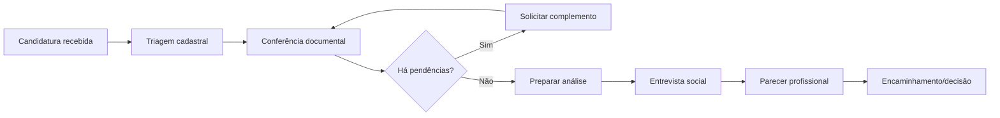

# AS-IS — processo atual, operações e analytics

> Objetivo: representar como o trabalho realmente acontece hoje, incluindo atalhos, exceções, filas, decisões e dados. Faça observação direta e análise de amostra; não se limite ao processo oficial.

## 1. Recorte do mapeamento

| Campo | Preenchimento |
|---|---|
| Processo/programa | [Nome] |
| Início do processo | [Evento inicial] |
| Fim do processo | [Evento final] |
| Período observado | [Datas/ciclo] |
| Unidades/equipes observadas | [Nomes] |
| Amostra | [Quantidade e critério] |
| Responsável pelo mapeamento | [Nome] |

## 2. Visão ponta a ponta

Adapte o fluxo após observar o processo:

### Limites e variações

- Evento que inicia o relógio: [Preencher]
- Evento que encerra o relógio: [Preencher]
- Caminho padrão: [Preencher]
- Variações por programa/campus/perfil: [Preencher]
- Etapas externas à equipe: [Preencher]

## 3. Service blueprint operacional

| # | Etapa | Ação do candidato | Ação visível da equipe | Trabalho interno | Sistema/canal | Entrada | Saída | Responsável | Tempo ativo | Tempo em fila | Retrabalho/exceção |
|---:|---|---|---|---|---|---|---|---|---:|---:|---|
| 1 | [Recebimento] | [Ação] | [Ação] | [Tarefa] | [Ferramenta] | [Objeto] | [Objeto] | [Papel] | [min] | [h/dias] | [Motivo] |

Para cada etapa, registre:

- o que dispara o trabalho;
- como a prioridade é definida;
- quais regras e checklists são usados;
- onde a evidência é registrada;
- quando e por que o caso muda de fila;
- como erros são encontrados e corrigidos;
- quem pode decidir e quem apenas recomenda.

## 4. Filas, volume e capacidade

### 4.1 Demanda

| Métrica | Valor | Janela | Fonte | Confiabilidade |
|---|---:|---|---|---|
| Candidaturas recebidas | [n] | [dia/semana/ciclo] | [Fonte] | [alta/média/baixa] |
| Pico de entrada | [n] | [Data/período] | [Fonte] | [...] |
| Documentos por candidatura | [mediana/p95] | [Período] | [Fonte] | [...] |
| % com complemento solicitado | [%] | [Período] | [Fonte] | [...] |
| % reabertas | [%] | [Período] | [Fonte] | [...] |

### 4.2 Capacidade e trabalho em andamento

| Etapa/fila | Pessoas/FTE | Horas disponíveis | Casos em aberto | Vazão | Idade mediana | Caso mais antigo |
|---|---:|---:|---:|---:|---:|---:|
| [Fila] | [n] | [h] | [n] | [casos/dia] | [dias] | [dias] |

### 4.3 Tempos

Separe tempo de trabalho (`touch time`) de tempo parado ou em fila (`wait time`).

| Etapa | Tempo ativo mediano | p90 ativo | Espera mediana | p90 espera | % do lead time |
|---|---:|---:|---:|---:|---:|
| [Etapa] | [min] | [min] | [h/dias] | [h/dias] | [%] |

## 5. Trabalho manual e desperdícios

| Atividade | Frequência | Minutos/caso | Motivo | Tipo de desperdício | Automatizável? | Risco da automação |
|---|---:|---:|---|---|---|---|
| [Copiar campo entre sistemas] | [x] | [y] | [Causa] | [espera/retrabalho/busca/transcrição] | [sim/parcial/não] | [Descrição] |

Observe especialmente:

- busca por arquivos ou versões;
- comparação manual entre documentos;
- digitação duplicada;
- comunicação repetitiva de pendências;
- espera por autorização ou informação;
- reanálise causada por contexto ausente;
- controles paralelos em planilhas ou mensagens.

## 6. Regras, decisões e exceções

### 6.1 Tabela de decisão atual

| ID | Pergunta/checagem | Dados usados | Regra aplicada | Resultado possível | Exceções | Evidência registrada | Dono da regra |
|---|---|---|---|---|---|---|---|
| DEC-001 | [Pergunta] | [Campos/docs] | [Regra] | [Resultados] | [Casos] | [Local] | [Papel] |

Classifique cada regra como `formal`, `interpretação local`, `prática informal` ou `hipótese`.

### 6.2 Catálogo de exceções

| Exceção | Frequência | Como é percebida | Tratamento atual | Quem resolve | Tempo adicional | Risco se ignorada |
|---|---:|---|---|---|---:|---|
| [Documento sem data] | [n/%] | [Sinal] | [Ação] | [Papel] | [min/dias] | [Impacto] |

## 7. Handoffs e responsabilidades

Use `R` responsável por executar, `A` accountable/aprovador, `C` consultado e `I` informado.

| Atividade | Candidato | Secretaria | Assistência social | Coordenação | TI | Privacidade/jurídico |
|---|---|---|---|---|---|---|
| Receber candidatura | [R/A/C/I] | [...] | [...] | [...] | [...] | [...] |
| Conferir completude | [...] | [...] | [...] | [...] | [...] | [...] |
| Validar inconsistência | [...] | [...] | [...] | [...] | [...] | [...] |
| Emitir parecer | [...] | [...] | [...] | [...] | [...] | [...] |
| Corrigir dado | [...] | [...] | [...] | [...] | [...] | [...] |

## 8. Analytics — linha de base

### 8.1 Árvore de métricas

**Resultado central:** [Ex.: candidaturas preparadas corretamente e dentro do prazo]

| Dimensão | Métrica | Definição/fórmula | Segmentações | Periodicidade | Dono |
|---|---|---|---|---|---|
| Fluxo | Lead time | `fim - início`, conforme eventos definidos | programa, etapa, canal | [freq.] | [papel] |
| Eficiência | Tempo ativo/caso | soma dos minutos de trabalho | etapa, analista | [...] | [...] |
| Qualidade | Taxa de reabertura | reabertas / concluídas | motivo, etapa | [...] | [...] |
| Completude | Pendências/caso | total de pendências / candidaturas | tipo de documento | [...] | [...] |
| Serviço | Prazo atendido | casos no prazo / casos concluídos | programa/ciclo | [...] | [...] |
| Equidade operacional | Diferença de erro/tempo | métrica por grupo/contexto | somente quando legítimo e protegido | [...] | [...] |

### 8.2 Dicionário mínimo de eventos

| Evento | Quando ocorre | Campos mínimos | Origem | Qualidade atual |
|---|---|---|---|---|
| `candidatura_recebida` | [Definição] | `candidatura_id`, `timestamp`, `canal` | [Sistema] | [Avaliação] |
| `documento_recebido` | [Definição] | `candidatura_id`, `documento_id`, `tipo`, `timestamp` | [Sistema] | [...] |
| `pendencia_aberta` | [Definição] | `tipo`, `motivo`, `origem`, `timestamp` | [Sistema] | [...] |
| `revisao_iniciada` | [Definição] | `revisor`, `motivo`, `timestamp` | [Sistema] | [...] |
| `analise_concluida` | [Definição] | `resultado_operacional`, `timestamp` | [Sistema] | [...] |

Não registre conteúdo sensível em logs analíticos quando identificadores pseudonimizados e categorias forem suficientes.

## 9. Sistemas e fontes de verdade

| Informação | Fonte de verdade | Cópias paralelas | Dono | Atualização | Problema de qualidade |
|---|---|---|---|---|---|
| Dados cadastrais | [Sistema] | [Planilha/e-mail] | [Área] | [Evento] | [Problema] |
| Documentos | [Repositório] | [Locais] | [Área] | [Evento] | [Problema] |
| Pendências | [Sistema] | [Locais] | [Área] | [Evento] | [Problema] |
| Parecer | [Sistema] | [Locais] | [Área] | [Evento] | [Problema] |

Complete o detalhe em [Inventário de documentos e dados](inventario-documentos-dados.md).

## 10. Dores priorizadas

Pontuação sugerida: `impacto (1–5) × frequência (1–5) × confiança da evidência (0,5/0,75/1)`.

| Dor | Usuário afetado | Evidência | Impacto | Frequência | Confiança | Pontuação | Causa-raiz provável |
|---|---|---|---:|---:|---:|---:|---|
| [Dor observável] | [Público] | [Fonte] | [1–5] | [1–5] | [0,5–1] | [valor] | [Hipótese] |

## 11. Oportunidades (sem fechar a solução)

Use: “Como poderíamos...?”

| Oportunidade | Dor relacionada | Benefício esperado | Risco | Evidência ainda necessária |
|---|---|---|---|---|
| Como poderíamos [ação]? | [Dor] | [Resultado] | [Risco] | [Pesquisa] |

## 12. Síntese do AS-IS

- Três maiores gargalos: [1], [2], [3]
- Três causas de retrabalho: [1], [2], [3]
- Etapas com maior risco para o candidato: [Preencher]
- Regras ainda tácitas ou divergentes: [Preencher]
- Dados indisponíveis para a linha de base: [Preencher]
- Hipóteses prioritárias para teste: [Preencher]
- Decisões necessárias antes do protótipo: [Preencher]
