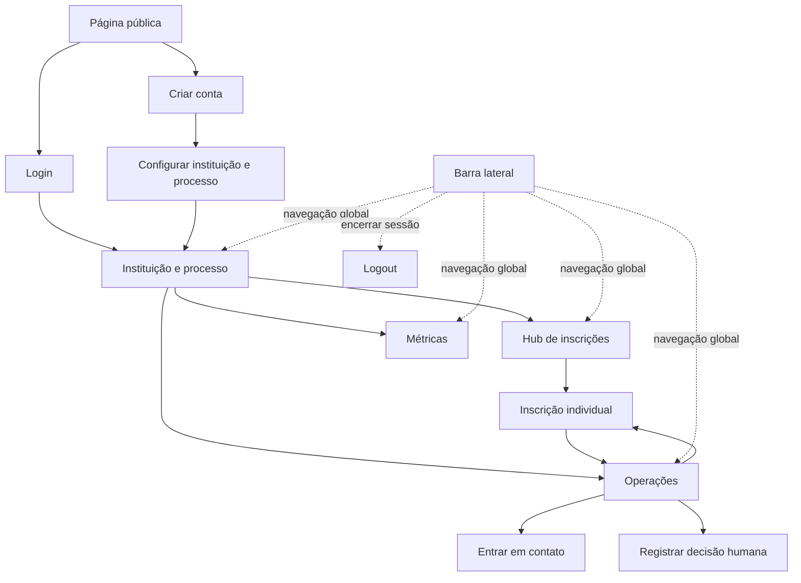
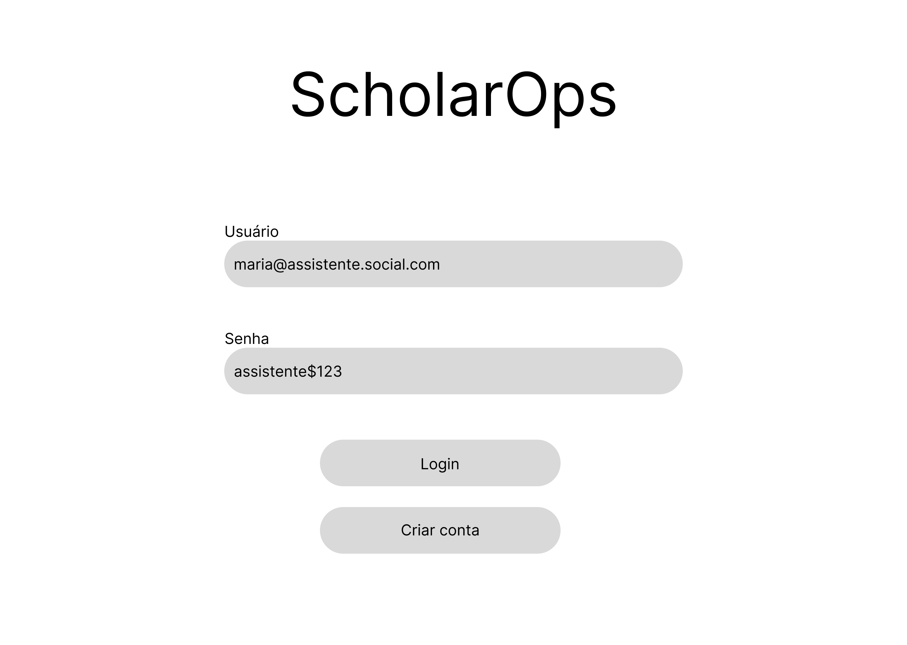
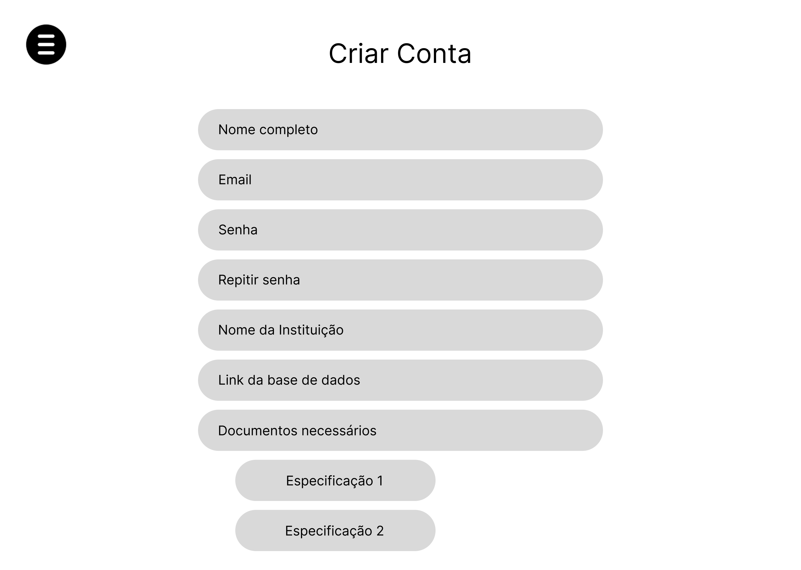
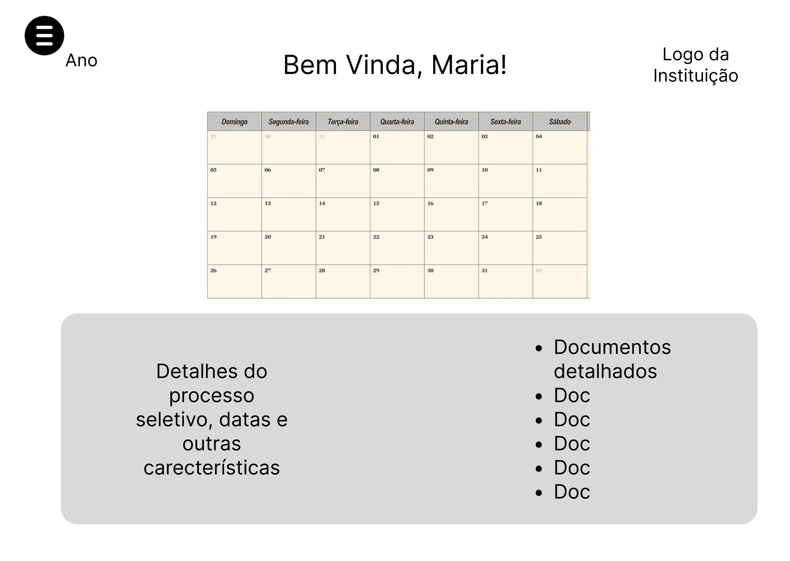
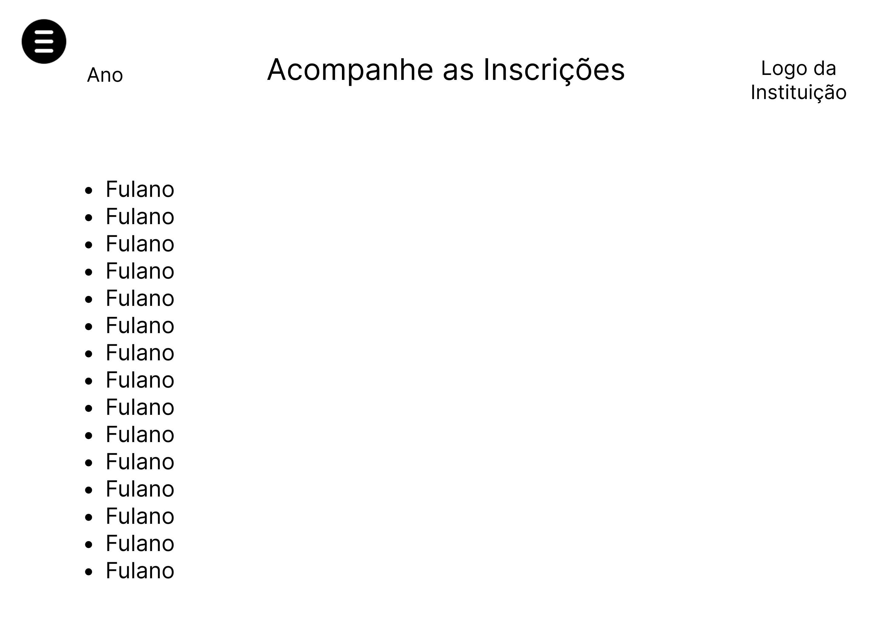
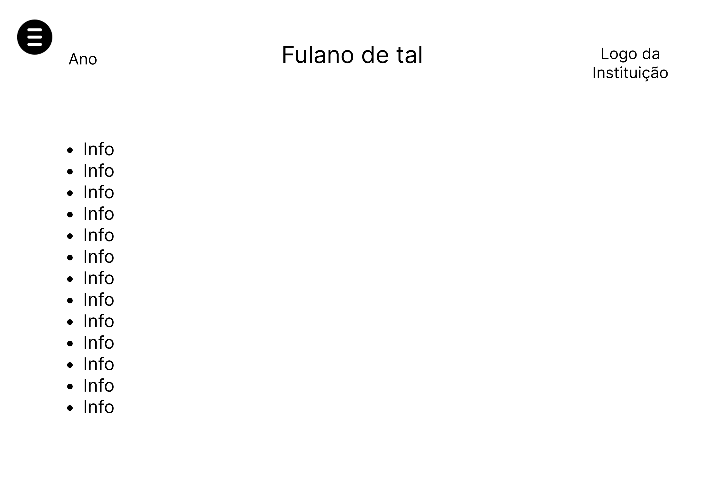
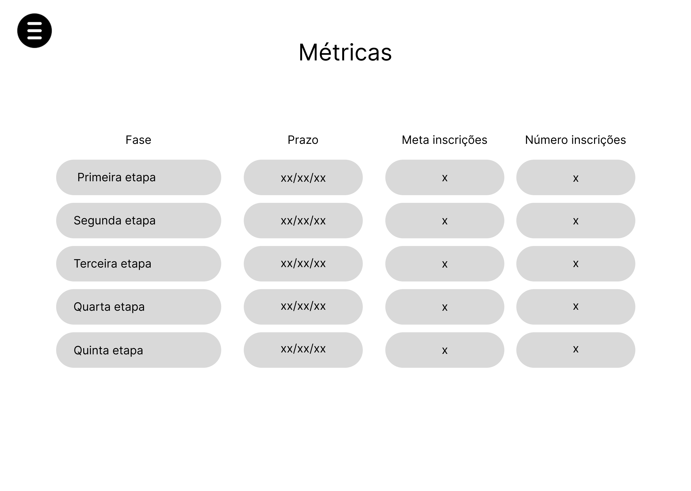
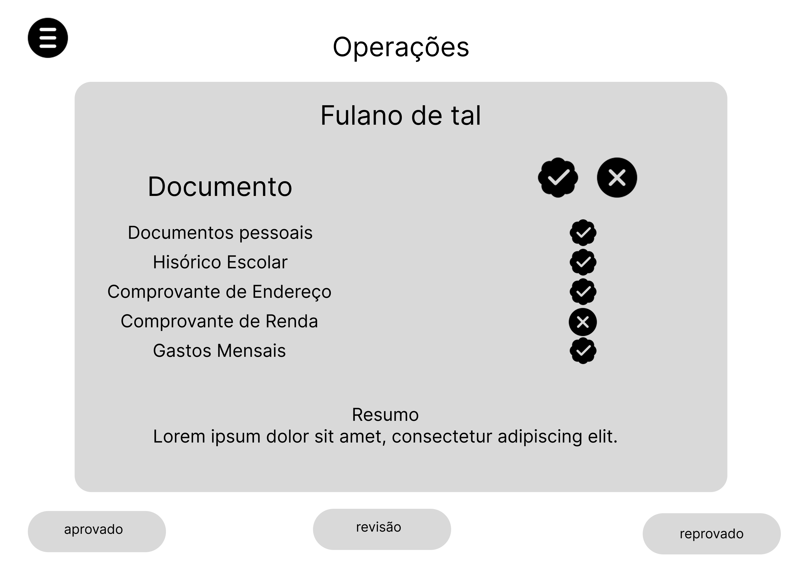

# Documentação de usabilidade e front-end

> Documento vivo que organiza os wireframes iniciais do ScholarOps e transforma as telas em requisitos de navegação, conteúdo, interação, segurança e validação de usabilidade. Embora esteja armazenado em `02-as-is`, ele documenta a proposta inicial de interface do produto e não uma interface já utilizada pelas instituições pesquisadas.

| Campo | Valor |
|---|---|
| Projeto | ScholarOps |
| Artefato | Wireframes de baixa fidelidade e especificação de usabilidade |
| Versão | 1.0 |
| Data | 2026-09-03 |
| Autoria dos wireframes | Autoria própria |
| Público principal | Assistentes sociais e profissionais responsáveis pela operação de bolsas |
| Público secundário | Coordenação institucional e equipe administrativa |
| Estado | Hipótese de solução a validar com usuários |

## 1. Objetivo

O front-end deverá reduzir o esforço de localizar, conferir e contextualizar informações de candidaturas. A interface não deverá substituir o estudo socioeconômico nem tomar decisões automaticamente. Seu papel é apresentar dados e documentos de forma organizada, apontar pendências objetivas, preservar as evidências e permitir que a pessoa responsável revise e registre sua decisão.

Esta documentação descreve:

- a arquitetura de informação da aplicação;
- o fluxo entre as telas;
- o objetivo e o conteúdo esperado em cada página;
- os estados de interface e as ações disponíveis;
- os limites entre recomendação automatizada e decisão humana;
- os requisitos iniciais de acessibilidade, segurança e responsividade;
- um plano de validação dos wireframes com usuários.

## 2. Princípios de experiência

1. **Evidência antes da conclusão:** todo alerta deve apontar para o documento, campo, página ou regra que o originou.
2. **Incerteza visível:** baixa confiança de extração deve aparecer como pedido de revisão, não como informação confirmada.
3. **Decisão humana explícita:** aprovação, reprovação e solicitação de revisão exigem ação consciente, justificativa e registro de autoria.
4. **Pendência acionável:** informar exatamente o que falta, para quem o documento é exigido e qual período deve ser coberto.
5. **Visão progressiva:** começar pelo resumo e permitir aprofundamento até a evidência original.
6. **Consistência:** navegação, status, filtros e ações devem manter os mesmos nomes e padrões em todas as telas.
7. **Privacidade por padrão:** exibir apenas os dados necessários para a tarefa e restringir acesso conforme perfil e instituição.
8. **Sem julgamento automatizado:** a interface não deve usar linguagem como “suspeito”, “fraude provável” ou “candidato de risco”.

## 3. Arquitetura de informação

### 3.1 Mapa de navegação

### 3.2 Inventário de páginas

| Página | Rota de referência | Acesso | Objetivo principal |
|---|---|---|---|
| Página pública | `/` | Público | Explicar o problema, a proposta, os limites e direcionar para login ou cadastro |
| Login | `/login` | Público | Autenticar uma pessoa usuária existente |
| Cadastro | `/cadastro` | Público | Criar a conta inicial e começar a configuração institucional |
| Instituição e processo | `/instituicao/processo` | Autenticado | Apresentar calendário, detalhes do processo e documentação exigida |
| Hub de inscrições | `/inscricoes` | Autenticado | Localizar, filtrar e abrir candidaturas |
| Inscrição individual | `/inscricoes/:id` | Autenticado e autorizado | Consultar o dossiê completo de um candidato |
| Métricas | `/metricas` | Autenticado | Acompanhar volume, etapas, prazos e resultados agregados |
| Operações | `/operacoes` | Autenticado | Revisar rapidamente cada caso e encaminhar a ação adequada |

As rotas são nomes de referência e podem mudar durante a implementação. Identificadores expostos em URL não devem conter CPF, nome ou outro dado pessoal direto.

## 4. Páginas públicas e autenticação

### 4.1 Página principal pública

A página principal deverá explicar o ScholarOps antes da autenticação. Ainda não existe um wireframe específico para essa tela. O arquivo chamado `homepage.png` representa visualmente o login e é documentado na seção seguinte.

Conteúdo mínimo proposto para a página pública:

- nome e propósito do projeto;
- descrição da dor enfrentada pelas equipes de bolsas e assistência social;
- explicação resumida do funcionamento: organizar, extrair, conferir, resumir e encaminhar;
- limites do sistema: não emite parecer social e não decide sozinho;
- benefícios esperados para candidatos, operação e profissionais;
- breve demonstração do fluxo do produto;
- informações sobre privacidade e uso responsável;
- chamadas para “Entrar” e “Criar conta”.

Critérios iniciais de usabilidade:

- o propósito deve ser compreendido sem necessidade de autenticação;
- os dois caminhos principais devem estar visíveis no primeiro bloco da página;
- textos devem usar linguagem direta e evitar promessas de aprovação ou detecção de fraude;
- o conteúdo precisa funcionar em telas pequenas e com ampliação de texto.

### 4.2 Login

  <small><strong style="font-size: 12px;">Figura 1: Página de login do ScholarOps</strong></small> 
   
  <small style="margin-top: 4px; font-size: 10px;">Fonte: autoria própria.</small> 

O wireframe apresenta a marca ScholarOps, campos de usuário e senha e as ações “Login” e “Criar conta”. Essa tela será a entrada para pessoas já cadastradas.

#### Conteúdo e comportamento esperado

| Elemento | Comportamento esperado |
|---|---|
| E-mail | Campo obrigatório com rótulo persistente, validação de formato e preenchimento automático permitido |
| Senha | Campo obrigatório mascarado, com opção acessível de mostrar/ocultar senha |
| Entrar | Envia as credenciais, informa carregamento e impede submissões duplicadas |
| Criar conta | Encaminha para o cadastro sem apagar informações desnecessariamente |
| Esqueci minha senha | Deve ser adicionado para recuperação segura de acesso |
| Mensagem de erro | Não deve revelar se um e-mail específico existe; deve orientar nova tentativa ou recuperação |

O e-mail e a senha visíveis no wireframe devem ser tratados somente como conteúdo ilustrativo. Na interface real, a senha nunca deverá aparecer preenchida ou exposta em texto simples.

#### Critérios de aceite

- a pessoa consegue navegar e enviar o formulário apenas com teclado;
- os campos possuem `label` programático, mensagens associadas e foco visível;
- após autenticação, a pessoa é direcionada ao último processo acessado ou à seleção de contexto;
- tentativas malsucedidas possuem limite e resposta segura;
- a sessão não é criada antes da autenticação ser confirmada.

### 4.3 Cadastro e início da configuração

  <small><strong style="font-size: 12px;">Figura 2: Página de criação de conta e configuração inicial</strong></small> 
   
  <small style="margin-top: 4px; font-size: 10px;">Fonte: autoria própria.</small> 

O wireframe reúne dados da pessoa usuária, credenciais, instituição, link da base de dados e documentos necessários. Para reduzir complexidade e risco, a implementação deverá dividir esse conteúdo em duas etapas:

1. **Conta:** nome, e-mail, senha, confirmação, aceite dos termos e verificação do e-mail;
2. **Configuração institucional:** instituição, processo, edição, fonte de dados e regras documentais.

Essa divisão evita solicitar configuração técnica antes de a conta existir e permite aplicar permissões específicas. Um link para base de dados não deve iniciar uma integração automaticamente; a conexão precisa ser validada, autorizada e testada sem expor credenciais.

#### Campos institucionais propostos

| Campo | Necessidade |
|---|---|
| Instituição | Nome e identificador interno da organização |
| Processo | Nome do programa ou edital que será analisado |
| Edição | Ano, semestre ou ciclo ao qual as regras pertencem |
| Fonte de dados | Upload controlado ou integração aprovada |
| Documentos necessários | Checklist estruturado por pessoa, situação e período |
| Especificações | Regras como formato, validade, quantidade de meses e alternativas aceitas |

#### Regras de usabilidade

- exibir progresso como “Etapa 1 de 2”;
- explicar por que cada dado é solicitado;
- validar senhas sem impedir colagem por gerenciadores de senha;
- permitir salvar a configuração institucional como rascunho;
- confirmar a instituição antes de importar qualquer candidatura;
- restringir a criação de processos e integrações a perfis autorizados.

## 5. Contexto da instituição e do processo

  <small><strong style="font-size: 12px;">Figura 3: Página da instituição e do processo seletivo</strong></small> 
   
  <small style="margin-top: 4px; font-size: 10px;">Fonte: autoria própria.</small> 

Esta página estabelece o contexto de trabalho. O wireframe mostra ano, saudação, logotipo da instituição, calendário, detalhes do processo e uma lista documental.

### 5.1 Conteúdo esperado

| Bloco | Informação |
|---|---|
| Contexto ativo | Instituição, processo, edição e status do ciclo |
| Calendário | Inscrição, prazo documental, complementação, entrevistas, resultado e matrícula conforme o processo |
| Detalhes | Público, benefícios, critérios, canais, responsáveis e etapas |
| Documentação | Categoria, membro aplicável, obrigatoriedade, validade, período e alternativas aceitas |
| Alertas | Prazo próximo, regra alterada, integração indisponível ou pendência de configuração |
| Ações | Editar processo, versionar regras, abrir inscrições ou visualizar métricas conforme permissão |

O calendário não deve depender apenas de cor. Cada evento precisa de nome, data, estado e descrição textual. Ao selecionar uma data, a pessoa deverá visualizar seu significado e os efeitos operacionais.

### 5.2 Regras documentais

A lista de documentos deve ser estruturada e versionada por `instituição + processo + edição + perfil`. Uma regra deverá registrar:

- qual documento é esperado;
- para qual integrante ou situação se aplica;
- se é obrigatório, condicional ou preferencial;
- quais alternativas são aceitas;
- qual período deve ser coberto;
- qual é a fonte da regra;
- quando a regra entrou em vigor;
- quem realizou a última alteração.

Mudanças de regra não devem alterar silenciosamente candidaturas de edições anteriores.

## 6. Hub de inscrições

  <small><strong style="font-size: 12px;">Figura 4: Hub de acompanhamento das inscrições</strong></small> 
   
  <small style="margin-top: 4px; font-size: 10px;">Fonte: autoria própria.</small> 

O hub é a porta de entrada para o conjunto de candidaturas. O wireframe mostra uma listagem simples de nomes. Na implementação, cada linha deverá funcionar como um resumo acionável e levar à inscrição individual.

### 6.1 Colunas mínimas

| Coluna | Finalidade |
|---|---|
| Candidato | Identificação suficiente para a tarefa |
| ID da candidatura | Diferenciar homônimos sem usar CPF como identificador visual principal |
| Etapa atual | Mostrar onde o caso está no processo |
| Situação documental | Completo, pendente, em revisão ou não analisado |
| Pendências | Quantidade e tipo geral das pendências abertas |
| Última atualização | Ajudar a identificar casos parados ou recém-alterados |
| Responsável | Pessoa ou equipe que está tratando o caso |
| Ação | Abrir a candidatura |

### 6.2 Busca e filtros

- busca por nome ou ID interno;
- filtros por etapa, situação documental, responsável e período;
- ordenação por prazo, última atualização e quantidade de pendências;
- visão “minha fila” para cada profissional;
- paginação ou carregamento progressivo;
- opção de limpar todos os filtros;
- contagem visível de resultados.

Estados vazios devem diferenciar “não existem inscrições”, “nenhum resultado para os filtros” e “não foi possível carregar”. A listagem não deve carregar ou expor mais dados pessoais do que os necessários.

## 7. Inscrição individual

  <small><strong style="font-size: 12px;">Figura 5: Página da inscrição individual</strong></small> 
   
  <small style="margin-top: 4px; font-size: 10px;">Fonte: autoria própria.</small> 

O wireframe apresenta o candidato e uma lista genérica de informações. A versão funcional deverá organizar o dossiê em blocos, evitando uma única página longa e sem hierarquia.

### 7.1 Estrutura proposta

| Aba/bloco | Conteúdo |
|---|---|
| Resumo | Situação atual, pendências, últimos eventos e próxima ação |
| Dados da candidatura | Informações declaradas no formulário e edição do processo |
| Grupo familiar | Integrantes, relações, ocupações e documentos associados |
| Documentos | Checklist, arquivos, páginas, período, qualidade e estado de revisão |
| Renda e despesas | Valores declarados e extraídos, sempre ligados às fontes |
| Comunicações | Pedidos de complemento, mensagens e respostas |
| Histórico | Alterações, análises, decisões e autoria de cada ação |

### 7.2 Interação com documentos

Ao abrir um documento, a pessoa deverá conseguir:

- visualizar o arquivo sem perdê-lo do contexto da candidatura;
- navegar entre páginas;
- identificar o membro familiar associado;
- conferir tipo, competência e campos extraídos;
- comparar valor declarado e extraído;
- corrigir uma extração e justificar a alteração;
- marcar o documento como adequado, inadequado ou necessitando esclarecimento;
- acessar a regra que tornou o documento necessário.

O sistema não deverá substituir o valor original por uma correção humana. Ambos devem permanecer no histórico, com autoria e horário.

## 8. Métricas

  <small><strong style="font-size: 12px;">Figura 6: Página de métricas do processo</strong></small> 
   
  <small style="margin-top: 4px; font-size: 10px;">Fonte: autoria própria.</small> 

O wireframe organiza métricas por etapa, prazo, meta e número de inscrições. A tela deverá apoiar gestão operacional e acompanhamento do processo sem expor dados individuais desnecessariamente.

### 8.1 Indicadores iniciais

| Grupo | Indicador |
|---|---|
| Volume | Inscrições iniciadas, submetidas e recebidas |
| Funil | Quantidade em cada etapa e taxa de passagem entre etapas |
| Documentação | Dossiês completos, pendentes, em revisão e ainda não analisados |
| Pendências | Casos com pendência, principais motivos e média de rodadas |
| Tempo | Tempo médio e mediano por etapa; casos próximos ou fora do prazo |
| Resultado | Aprovados, reprovados, desistentes e ainda sem decisão |
| Operação | Fila por responsável e volume revisado no período |
| Qualidade do apoio | Extrações corrigidas, alertas confirmados e alertas descartados |

Metas devem aparecer separadas dos resultados reais. Uma taxa não pode ser exibida sem numerador, denominador, período e definição acessível.

### 8.2 Filtros e privacidade

- instituição, processo e edição;
- período de referência;
- etapa e situação;
- categoria documental;
- equipe ou responsável, apenas quando permitido;
- exportação agregada com controle de acesso.

Gráficos devem ter título, legenda, unidade e alternativa tabular. Informações agregadas com grupos muito pequenos precisam de tratamento para evitar reidentificação.

## 9. Operações e triagem assistida

  <small><strong style="font-size: 12px;">Figura 7: Página de operações e triagem assistida</strong></small> 
   
  <small style="margin-top: 4px; font-size: 10px;">Fonte: autoria própria.</small> 

O arquivo do wireframe utiliza o nome `match.png`, mas a funcionalidade será denominada **Operações** ou **Triagem assistida**. A interação não deve incentivar decisões instantâneas baseadas apenas em um cartão resumido.

Esta é a tela central para a assistente social ou profissional autorizado. O wireframe mostra nome do candidato, estado dos documentos, resumo e ações de aprovação, revisão e reprovação.

### 9.1 Conteúdo do cartão operacional

| Área | Conteúdo necessário |
|---|---|
| Identificação | Nome, ID, processo e etapa atual |
| Resumo factual | Composição familiar, renda declarada, ocupações e contexto cadastral relevante |
| Estado documental | Quantidade adequada, faltante, ilegível, incompleta, divergente e não revisada |
| Principais insights | Pendências e divergências objetivas com fonte e confiança |
| Evidências | Links diretos para documento, página e campo relacionado |
| Histórico | Último contato, correções e ações anteriores |
| Próxima ação | Revisar documento, solicitar complemento, entrar em contato ou registrar decisão |

### 9.2 Significado das ações

| Ação | Comportamento |
|---|---|
| Aprovar | Disponível somente a perfil autorizado; abre confirmação e exige fundamento conforme processo |
| Solicitar revisão | Encaminha para outra pessoa ou fila, com motivo e documentos associados |
| Reprovar | Exige confirmação, motivo previsto ou justificativa e registro de autoria |
| Entrar em contato | Abre os dados e canais autorizados do candidato e permite preparar mensagem sobre uma pendência específica |
| Ver candidatura completa | Direciona para a inscrição individual preservando o ponto de análise |
| Próximo caso | Só avança depois de salvar ou descartar conscientemente alterações |

Os botões não devem usar apenas ícones de “certo” ou “errado”. Precisam apresentar texto, descrição acessível e distância suficiente para evitar acionamento acidental. Aprovação e reprovação não podem ocorrer por gesto de deslizar nem por um único clique sem confirmação.

### 9.3 Resumo e insights

O resumo deve separar visualmente:

1. **informações declaradas pelo candidato**;
2. **informações extraídas dos documentos**;
3. **comparações produzidas por regras objetivas**;
4. **observações registradas por profissionais**.

Cada insight deve responder:

- o que foi encontrado;
- em qual fonte foi encontrado;
- qual regra foi aplicada;
- qual é o nível de confiança;
- qual ação humana é recomendada;
- se houve correção ou discordância anterior.

Exemplo adequado: “O formulário declara renda mensal de R$ X. O comprovante Y apresenta R$ Z no mês M. Conferir diferença.” Exemplo inadequado: “Candidato provavelmente ocultou renda.”

### 9.4 Contato com o candidato

O contato deverá partir de uma pendência estruturada. A interface deve preencher uma sugestão editável com:

- nome do item;
- pessoa do grupo familiar a que se refere;
- motivo da pendência;
- período ou formato esperado;
- prazo de resposta;
- canal de suporte.

Antes do envio, a pessoa responsável revisa o texto e o destinatário. O sistema registra conteúdo, canal, data, autoria e vínculo com a pendência.

## 10. Barra lateral e navegação global

O botão de menu aparece em quase todos os wireframes. Quando aberto, deverá formar uma barra lateral com:

- Visão geral;
- Instituição e processo;
- Inscrições;
- Operações;
- Métricas;
- Configurações, conforme permissão;
- Ajuda;
- Sair.

### 10.1 Comportamento

- mostrar instituição, processo e edição ativos no topo;
- destacar a página atual por texto e não somente por cor;
- permanecer aberta em telas grandes e funcionar como painel recolhível em telas pequenas;
- devolver o foco ao botão de origem quando for fechada;
- fechar por botão, tecla `Esc` e seleção de destino;
- avisar antes de trocar de página quando existirem alterações não salvas;
- separar visualmente “Sair” das opções de navegação;
- ao sair, encerrar a sessão e retornar ao login sem manter dados sensíveis em tela.

## 11. Fluxos principais de tarefa

### 11.1 Primeiro acesso institucional

1. A pessoa acessa a página pública e seleciona “Criar conta”.
2. Informa dados da conta e confirma o e-mail.
3. Cadastra instituição, processo e edição.
4. Define ou importa as regras documentais.
5. Revisa um resumo da configuração.
6. Ativa o processo ou salva como rascunho.
7. É direcionada à página da instituição e do processo.

### 11.2 Conferência de uma candidatura

1. A profissional acessa “Inscrições” ou “Minha fila”.
2. Filtra casos por etapa ou pendência.
3. Abre uma inscrição.
4. Lê o resumo factual e identifica os itens não revisados.
5. Abre as evidências e confere documento por documento.
6. Corrige extrações ou registra observações quando necessário.
7. Solicita complemento, encaminha à revisão ou registra a decisão dentro de sua atribuição.
8. O sistema salva o histórico e atualiza a fila e as métricas.

### 11.3 Triagem simplificada

1. A profissional acessa “Operações”.
2. O sistema mostra o próximo caso da fila e explica o critério de ordenação.
3. A profissional confere resumo, documentos e insights.
4. Se o resumo não for suficiente, abre a inscrição completa sem perder o caso atual.
5. Seleciona a ação e registra o fundamento.
6. Confirma a ação.
7. O sistema apresenta retorno de sucesso e carrega o próximo caso.

## 12. Estados de interface

Todas as páginas que carregam dados devem prever:

| Estado | Tratamento esperado |
|---|---|
| Carregando | Indicador de progresso com descrição do conteúdo sendo carregado |
| Vazio | Explicação do motivo e ação possível |
| Erro | Mensagem clara, preservação do trabalho e opção de tentar novamente |
| Sem permissão | Informação de acesso insuficiente sem revelar dados protegidos |
| Integração indisponível | Última sincronização, impacto e alternativa segura |
| Dados atualizados | Confirmação discreta e registro do horário |
| Alterações não salvas | Aviso antes de sair ou trocar de contexto |
| Sessão expirada | Retorno ao login e recuperação segura do trabalho não sensível quando possível |

## 13. Acessibilidade e responsividade

### 13.1 Requisitos iniciais

- contraste adequado entre texto, fundo, controles e estados;
- escala tipográfica legível e suporte a ampliação de pelo menos 200%;
- navegação completa por teclado;
- ordem de foco equivalente à ordem visual e lógica;
- rótulos programáticos e mensagens de erro associadas aos campos;
- alvos de toque suficientemente grandes e separados;
- texto junto aos ícones e estados;
- tabelas com cabeçalhos e alternativa responsiva;
- gráficos acompanhados de tabela ou resumo textual;
- movimento reduzido quando solicitado pelo sistema operacional;
- não depender somente de cor, posição ou símbolo para transmitir informação.

### 13.2 Adaptação por tela

| Componente | Desktop | Tela pequena |
|---|---|---|
| Barra lateral | Persistente ou recolhível | Painel sobreposto acionado pelo menu |
| Hub | Tabela com colunas configuráveis | Cartões com os mesmos campos essenciais |
| Inscrição | Duas áreas para documento e dados | Uma área por vez com navegação clara |
| Métricas | Cards, gráficos e tabela | Cards empilhados e tabela rolável com alternativa |
| Operações | Resumo e evidência lado a lado | Resumo primeiro e evidência em painel dedicado |

## 14. Segurança, privacidade e rastreabilidade na interface

- ocultar dados sensíveis que não sejam necessários para a tarefa atual;
- não exibir CPF, endereço ou dados bancários em listagens gerais;
- não registrar conteúdo sensível em URLs, analytics ou mensagens técnicas;
- aplicar permissões por instituição, processo e função;
- registrar visualização, alteração, contato, encaminhamento e decisão relevantes;
- exibir claramente quando um conteúdo foi produzido pelo sistema ou por uma pessoa;
- impedir download em massa sem permissão e justificativa;
- encerrar ou bloquear sessões ociosas conforme a política institucional;
- impedir que dados de uma instituição apareçam no contexto de outra;
- usar dados sintéticos durante prototipação e testes iniciais.

## 15. Plano inicial de teste de usabilidade

### 15.1 Participantes

Realizar a primeira rodada com 5 a 8 participantes, buscando incluir:

- assistentes sociais que já analisaram candidaturas;
- profissionais de secretaria ou operação documental;
- ao menos uma pessoa com responsabilidade de coordenação;
- diferentes níveis de familiaridade com sistemas digitais.

### 15.2 Tarefas de teste

| Tarefa | Resultado esperado |
|---|---|
| Localizar o prazo de entrevista | Participante encontra a informação na página do processo sem ajuda |
| Encontrar uma candidatura pendente | Usa busca ou filtro e abre o caso correto |
| Descobrir qual documento falta | Identifica documento, membro familiar, período e regra |
| Conferir uma divergência de renda | Abre as duas evidências e explica a diferença sem inferir fraude |
| Solicitar complemento | Prepara e revisa a comunicação vinculada à pendência |
| Encaminhar para revisão | Escolhe motivo, responsável/fila e confirma a ação |
| Registrar uma decisão | Localiza evidências, informa fundamento e confirma conscientemente |
| Consultar andamento do processo | Encontra volume e situação por etapa nas métricas |
| Fazer logout | Localiza “Sair” e encerra a sessão com segurança |

### 15.3 Métricas da avaliação

- conclusão da tarefa sem ajuda;
- tempo por tarefa;
- erros, retornos e cliques sem efeito;
- compreensão correta dos status e insights;
- tentativas de decidir sem abrir evidência;
- percepção de confiança, controle e carga de trabalho;
- escala de facilidade após cada tarefa;
- comentários qualitativos e sugestões dos participantes.

O teste deve avaliar o desenho, não a habilidade da pessoa. Se várias pessoas falharem na mesma tarefa, o primeiro objeto de revisão é a interface.

## 16. Critérios para avançar à alta fidelidade

- [ ] Existe wireframe específico para a página pública;
- [ ] cadastro de conta e configuração institucional estão separados;
- [ ] conteúdo e ordem da barra lateral foram validados;
- [ ] profissionais compreendem a diferença entre “adequado”, “pendente” e “requer revisão”;
- [ ] resumo e evidências podem ser comparados sem perda de contexto;
- [ ] aprovação e reprovação exigem confirmação e fundamento;
- [ ] fluxo de contato foi validado com mensagens reais anonimizadas ou sintéticas;
- [ ] filtros do hub correspondem às filas utilizadas na prática;
- [ ] métricas possuem definição, período e fonte dos dados;
- [ ] estados de erro, vazio, carregamento e falta de permissão foram desenhados;
- [ ] versão móvel e navegação por teclado foram testadas;
- [ ] requisitos de privacidade e perfis de acesso foram revisados.

## 17. Lacunas identificadas nos wireframes

| Lacuna | Impacto | Próxima decisão |
|---|---|---|
| Página pública ainda não representada | A proposta do projeto não aparece antes do login | Criar wireframe próprio para apresentação do ScholarOps |
| `homepage.png` representa login | Nome do ativo pode causar confusão durante implementação | Renomear futuramente sem quebrar referências ou manter mapeamento documentado |
| Cadastro concentra conta e integração | Formulário extenso e risco de configuração indevida | Dividir em etapas e aplicar permissões |
| Hub mostra apenas nomes | Não permite priorização nem compreensão da fila | Adicionar status, filtros, prazos e responsável |
| Inscrição individual usa lista genérica | Não representa grupo familiar, documentos e evidências | Estruturar em abas/blocos e prototipar visualização documental |
| Métricas não mostram aprovados ou pendências | Cobertura operacional insuficiente | Adicionar funil, resultados, tempo e qualidade |
| Operações usa decisões muito imediatas | Risco de decisão superficial ou acionamento acidental | Exigir evidência, justificativa e confirmação |
| Contato com candidato não está desenhado | Uma das ações principais não possui fluxo visual | Criar modal/página de comunicação e histórico |
| Barra lateral aparece apenas fechada | Navegação e logout ainda não podem ser avaliados | Criar estados aberto, recolhido e móvel |
| Estados de erro e carregamento ausentes | Não é possível testar recuperação e resiliência | Criar variantes para cada página |

## 18. Histórico de alterações

| Data | Versão | Alteração |
|---|---|---|
| 2026-09-03 | 1.0 | Criação da documentação de usabilidade, associação dos sete wireframes e definição inicial de fluxos, conteúdo e critérios de teste |

