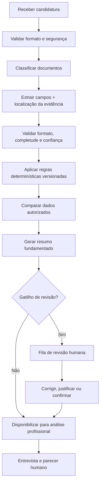
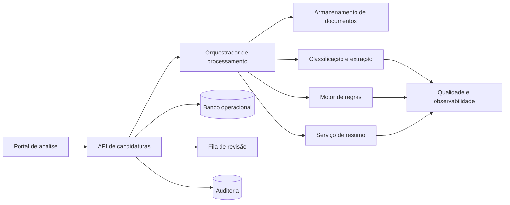

# Processo técnico TO-BE

> Template para desenhar e validar o fluxo técnico futuro. Preencha somente depois de compreender o AS-IS e as regras. O sistema apoia a análise; não concede nem nega bolsas automaticamente.

## 1. Objetivo e fronteiras

**Objetivo técnico:** [Capacidade que o sistema entregará e resultado operacional associado]

**Entradas:** [Formulários, documentos, regras, dados de sistemas autorizados]

**Saídas:** [Dados extraídos, checks, pendências, resumo, indicação de revisão, trilha de auditoria]

**Decisões proibidas ao sistema:** [Aprovação/reprovação, parecer social, inferências sensíveis etc.]

**Usuários e permissões:** [Papéis que visualizam, corrigem, revisam e administram]

## 2. Fluxo futuro



Em todas as etapas, registre identificadores, timestamps, versão da regra/modelo e resultado sem copiar conteúdo sensível desnecessário para logs.

## 3. Contrato de cada etapa

| Etapa | Entrada | Processamento | Saída estruturada | Falhas previstas | Fallback | Responsável |
|---|---|---|---|---|---|---|
| Ingestão | [Entrada] | [Validações] | [Objeto] | [Falhas] | [Tratamento] | [Componente/papel] |
| Classificação | [Entrada] | [Método] | [Tipo + confiança] | [...] | Revisão | [...] |
| Extração | [Entrada] | [OCR/parser/modelo] | [Campo + fonte + confiança] | [...] | Revisão/correção | [...] |
| Regras | [Dados] | [Motor versionado] | [Check + evidência] | [...] | Não concluir | [...] |
| Resumo | [Dados validados] | [Método] | [Resumo + citações internas] | [...] | Exibir dados estruturados | [...] |
| Encaminhamento | [Sinais] | [Regras explícitas] | [Fila + motivo] | [...] | Fila geral | [...] |

## 4. Arquitetura conceitual



### Componentes

| Componente | Responsabilidade | Compra/constrói/experimento | Dados acessados | Criticidade |
|---|---|---|---|---|
| Portal de análise | [Descrição] | [Escolha] | [Dados] | [Nível] |
| API | [Descrição] | [Escolha] | [Dados] | [Nível] |
| Armazenamento | [Descrição] | [Escolha] | [Dados] | [Nível] |
| Extração | [Descrição] | [Escolha] | [Dados] | [Nível] |
| Motor de regras | [Descrição] | [Escolha] | [Dados] | [Nível] |
| Resumo | [Descrição] | [Escolha] | [Dados] | [Nível] |
| Auditoria | [Descrição] | [Escolha] | [Dados] | [Nível] |

## 5. Modelo de saída por candidatura

Exemplo conceitual — adapte após o inventário:

```json
{
  "candidatura_id": "id-pseudonimizado",
  "versao_processamento": "2026-01",
  "documentos": [
    {
      "tipo": "comprovante_exemplo",
      "status": "recebido",
      "confianca_classificacao": 0.97
    }
  ],
  "campos": [
    {
      "nome": "campo_exemplo",
      "valor": "valor_sintetico",
      "fonte": {"documento_id": "doc-1", "pagina": 1, "regiao": "ref-visual"},
      "confianca": 0.91,
      "confirmado_por_humano": false
    }
  ],
  "checks": [
    {
      "regra_id": "REG-001",
      "versao": "3",
      "resultado": "revisar",
      "motivo": "valores divergentes entre duas fontes",
      "evidencias": ["doc-1:pagina-1", "formulario:campo-x"]
    }
  ],
  "revisao": {
    "necessaria": true,
    "motivos": ["baixa_confianca_extracao"],
    "prioridade_operacional": "normal"
  }
}
```

Não use um score único de “risco do candidato”. Preserve sinais separados, observáveis e contestáveis.

## 6. Regras versus modelos

| Necessidade | Abordagem preferida | Por quê | Critério para revisão humana |
|---|---|---|---|
| Documento obrigatório | Regra determinística | Auditável e ligada ao edital | Exceção ou regra ambígua |
| Data/valor em documento | OCR/extração + validação | Conteúdo não estruturado | Confiança abaixo do limite |
| Validade | Regra determinística sobre campo confirmado | Reproduzível | Campo ausente/ilegível |
| Divergência entre fontes | Comparação determinística | Descreve diferença objetiva | Sempre que afetar análise |
| Resumo | Modelo generativo restrito às fontes | Reduz leitura repetitiva | Fonte ausente ou afirmação crítica |
| Parecer/concessão | Humano | Decisão contextual e de alto impacto | Sempre |

## 7. Gatilhos de revisão humana

Defina por tarefa e pelo custo do erro; não escolha um limiar único por conveniência.

| ID | Gatilho | Condição | Fila | SLA | O que o revisor vê | Ação possível |
|---|---|---|---|---|---|---|
| REV-001 | Baixa confiança | [Limiar por campo/doc] | [Fila] | [Tempo] | Fonte destacada + extração | Corrigir/confirmar |
| REV-002 | Documento desconhecido | Tipo não reconhecido | [Fila] | [Tempo] | Documento e alternativas | Classificar |
| REV-003 | Divergência relevante | Regra [ID] acionada | [Fila] | [Tempo] | Duas fontes lado a lado | Justificar/solicitar dado |
| REV-004 | Falha técnica | Processamento incompleto | [Fila] | [Tempo] | Etapa e erro seguro | Reprocessar/escalar |
| REV-005 | Contestação | Correção solicitada | [Fila] | [Tempo] | Histórico e evidências | Corrigir/responder |

## 8. Experiência da assistente social

A tela de candidatura deve permitir:

- identificar claramente dados informados versus extraídos versus inferidos;
- abrir a fonte exata de cada campo ou frase do resumo;
- visualizar pendências como fatos observados, sem linguagem acusatória;
- corrigir valores e registrar justificativa;
- distinguir “não encontrado”, “ilegível”, “divergente” e “não aplicável”;
- compreender por que o caso foi encaminhado para revisão;
- registrar preparo da entrevista separadamente do parecer final;
- ver histórico de alterações e versão das regras utilizadas.

### Estrutura sugerida da visão individual

1. Identificação mínima e status operacional;
2. resumo fundamentado da candidatura;
3. documentos e completude;
4. pendências e divergências, com evidências;
5. pontos para confirmar em entrevista;
6. histórico, correções e auditoria.

## 9. Requisitos não funcionais

| Categoria | Requisito mensurável | Meta | Como testar |
|---|---|---|---|
| Segurança | [Ex.: acesso por função] | [Meta] | [Teste] |
| Privacidade | [Ex.: retenção/exclusão] | [Meta] | [Teste] |
| Desempenho | Tempo de processamento por candidatura | [p50/p95] | [Teste de carga] |
| Disponibilidade | [SLO] | [%] | [Monitoramento] |
| Acessibilidade | Conformidade da interface | [Critério] | [Auditoria] |
| Auditabilidade | Saídas com versão e fonte | [100%] | [Consulta/amostra] |
| Recuperação | [RPO/RTO] | [Valores] | [Simulação] |

## 10. Segurança e privacidade por desenho

- Elaborar inventário e fluxo de dados antes do protótipo com dados reais;
- Validar finalidade e base legal com responsável por privacidade/jurídico;
- Aplicar menor privilégio e separar papéis de operação, revisão e administração;
- Criptografar dados em trânsito e repouso;
- Manter segredos fora do código e dos logs;
- Pseudonimizar dados em analytics, testes e avaliação;
- Definir retenção, exclusão, backup e resposta a incidentes;
- Proibir treinamento ou envio a terceiros sem autorização e avaliação contratual;
- Testar arquivos maliciosos, prompt injection em documentos e conteúdo ativo;
- Registrar acesso a documentos e alterações em resultados.

## 11. Avaliação de qualidade

### 11.1 Conjunto de avaliação

| Recorte | Quantidade | Origem/autorização | Cobertura | Rotulagem | Revisão de desacordo |
|---|---:|---|---|---|---|
| [Tipo de documento/cenário] | [n] | [Descrição] | [Variações] | [Papel] | [Processo] |

Use primeiro dados sintéticos e anonimizados. Dados reais exigem governança, acesso e finalidade formalizados.

### 11.2 Métricas por capacidade

| Capacidade | Métrica principal | Erro crítico | Segmentações | Critério mínimo |
|---|---|---|---|---|
| Classificação | F1 por tipo | Tipo obrigatório classificado errado | tipo/formato/qualidade | [Meta] |
| Extração | Exatidão por campo | Valor financeiro/data incorreto | campo/doc/legibilidade | [Meta] |
| Pendência | Precision e recall por regra | Pendência crítica omitida | regra/tipo/contexto | [Meta] |
| Resumo | Fidelidade às fontes | Afirmação não sustentada | seção/tipo de caso | [Meta] |
| Encaminhamento | Recall de revisão necessária | Caso crítico não revisado | motivo/fila | [Meta] |

Meça também taxa de correção humana, tempo de revisão, falso alerta e concordância entre avaliadores. Resultados globais podem esconder falhas em tipos raros de documento.

## 12. Observabilidade e operação

| Sinal | Métrica/alerta | Limiar | Resposta | Responsável |
|---|---|---|---|---|
| Falha de processamento | % com erro por etapa | [Valor] | [Runbook] | [Papel] |
| Mudança de entrada | distribuição de tipos/formato | [Valor] | [Investigar] | [Papel] |
| Queda de confiança | confiança por campo/modelo | [Valor] | [Revisão/amostra] | [Papel] |
| Correção humana | % corrigido por campo/regra | [Valor] | [Reavaliar] | [Papel] |
| Fila | idade/volume | [Valor] | [Redistribuir/escalar] | [Papel] |

Defina runbooks para indisponibilidade, saída incorreta, regra desatualizada, vazamento, contestação e rollback de versão.

## 13. Plano incremental

| Fase | Pergunta que responde | Escopo | Dados permitidos | Critério de avanço | Critério de parada |
|---|---|---|---|---|---|
| 0 — descoberta | A dor e a linha de base estão claras? | Pesquisa AS-IS | Sem dados pessoais no repo | Evidência suficiente | Falta de finalidade/owner |
| 1 — bancada | A extração funciona em casos controlados? | 1–2 docs | Sintéticos/anonimizados | Métricas mínimas | Erro crítico acima do limite |
| 2 — shadow mode | O sistema apoia sem afetar decisões? | Amostra controlada | Governados | Comparação cega + revisão | Dano, viés ou instabilidade |
| 3 — piloto assistido | Há ganho operacional seguro? | Equipe/ciclo limitado | Produção controlada | Guardrails atendidos | SLA/qualidade violados |
| 4 — expansão | O desempenho se mantém? | Mais tipos/equipes | Produção | Monitoramento estável | Drift/incidente |

No `shadow mode`, a saída não deve alterar o fluxo do candidato; ela é comparada à análise humana para avaliação.

## 14. Decisões técnicas abertas

| Questão | Opções | Critérios | Evidência/experimento | Decisor | Prazo |
|---|---|---|---|---|---|
| OCR/extração | [Opções] | [Privacidade, qualidade, custo] | [Teste] | [Papel] | [Data] |
| Armazenamento | [Opções] | [Segurança, retenção, integração] | [Análise] | [Papel] | [Data] |
| Regras | [Opções] | [Versionamento, autoria, teste] | [Protótipo] | [Papel] | [Data] |
| Resumo | [Opções] | [Fidelidade, latência, privacidade] | [Avaliação] | [Papel] | [Data] |

Registre escolhas consolidadas no [Registro de decisões](../05-governanca/registro-de-decisoes.md).
